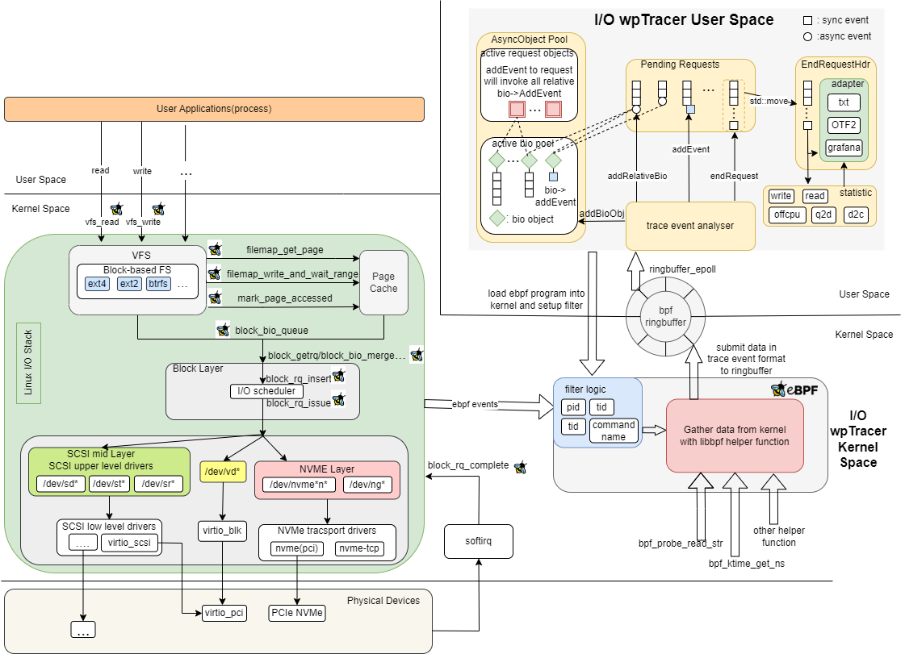

# 简介
本项目实现了一个名为 zero-tracer 的 eBPF tracing 工具，它能够追踪 read/write 等 IO 系统调用在内核中各个子模块中的处理流程，并且在 12k read iops 和 250 write iops 环境下能保持小于 5% 的系统 CPU 开销。zero 表示低开销。

zero-tracer 可以用于常态化部署，辅助运维人员定位业务时延抖动，还可以用于分析性能瓶颈以及优化数据通路。

并且，我们把 zero-tracer 拓展到了 qemu/kvm 场景下的 virtio 从 guest 到 qemu 再到 host 的全链路追踪。这加强了 zero-tracer 在虚拟化场景下的实用性。

本项目来自于[oscomp-proj133](https://github.com/oscomp/proj133-ebpf-tracing-framework).

文档列表：
- [复赛开发文档](./doc/复赛开发文档.md)
- [项目文件结构描述文档](./doc/structure.md)
- [性能测试文档](./doc/performance_test.md)
- [功能测试文档](./doc/functional_test.md)
- [挂载点语义文档](./doc/io_hookpoint.md)
- [环境配置文档](./doc/env.md)

可以查看我们的[复赛开发文档](doc/复赛开发文档.md)来了解我们的工作
也可以访问我们的[Github页面](https://github.com/hrpccs/zero-trace)



本项目基于eBPF 和 Libbpf+CO-RE.如果要编译这个项目,需要
- 支持Libbpf+CO-RE 
- 确保你的内核支持BTF

## 环境配置

请参考[环境配置文档](./doc/env.md)

## 编译 qemu

本项目依赖于 qemu 的头文件，编译脚本默认从本项目根目录下的 qemu 目录下找

如果你需要进行 qemu/kvm 下 virtio 追踪的验证，需要把 `src/qemu_uprobe.bpf.c` 下的 QEMU_EXE 改成你编译出来的带符号表的 qemu 二进制文件。


```bash
$ cd qemu
$ git checkout v6.0.0
$ mkdir build && cd build
$ ../configure
$ make 
```

## 编译运行

```bash
$ cmake -S . -B build -DWITH_GRAFANA=OFF
$ cd build 
$ make 
$ sudo ./iotracer  -h 
```

## 启动 grafana 可视化

如果你要启动grafana，请将下面这个宏添加到`src/include/basic_types.h`
```
#define GRAFANA
```
并在编译时采用如下命令
```
cmake -S . -B build -DWITH_GRAFANA=ON
```