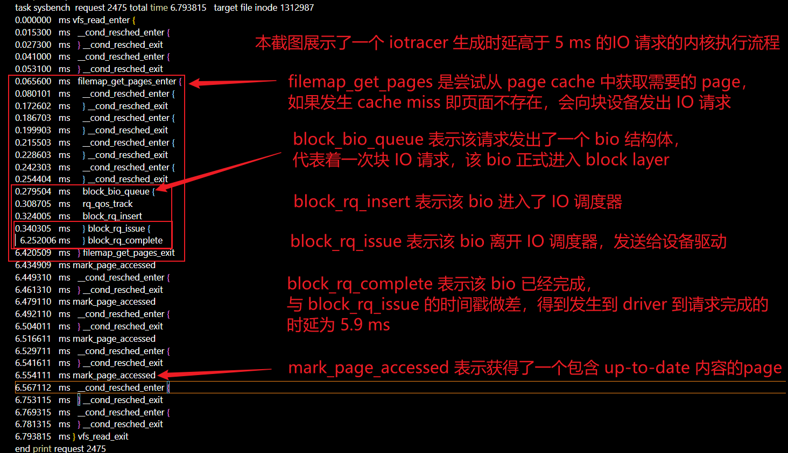
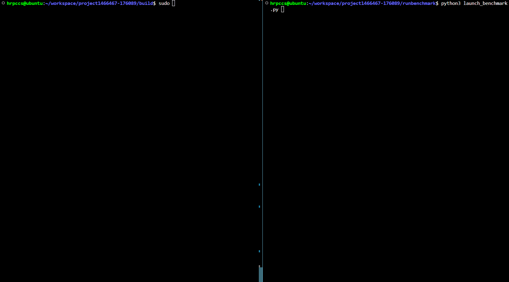
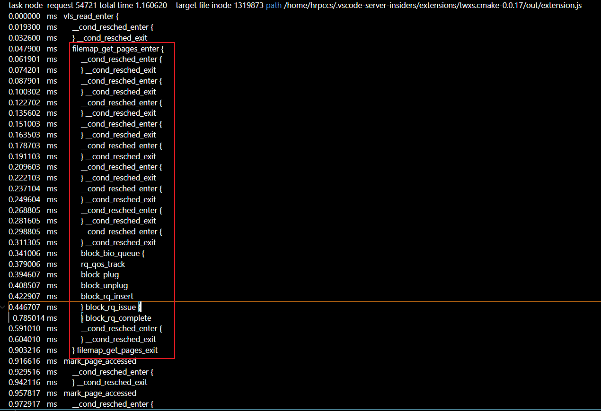

# **操作系统初赛文档**

# 成员信息

学校：中山大学

学院：计算机学院

专业：计算机科学与技术（系统结构）

指导老师：陈鹏飞

| 姓名   | 年级 | 邮箱                      |
| ------ | ---- | ------------------------- |
| 边润华 | 大三 | bianrh5@mail2.sysu.edu.cn |
| 洪瑞鹏 | 大三 | hongrp@mail2.sysu.edu.cn  |
| 涂越   | 大三 | tuyue3@mail2.sysu.edu.cn  |

# **一、背景概述**

eBPF-tracing工具是基于eBPF技术实现的内核跟踪工具。它能够有效地获取系统应用程序与内核之间的额外诊断信息，从而帮助工程师分析程序在内核态的处理流程。如今已经有不少较为成熟的ebpf-tracing工具，如bcc、bpftrace、systempTap等。

而这些工具的共同劣势在于  

1. 难以进行完整的全链路分析
2. 会造成较大的额外开销，无法做到常态化部署。

例如现存的bcc工具只着眼于特定函数的延时，没有关注整个处理流程的细化时延； 

[bcc/biolatency.py](https://github.com/iovisor/bcc/blob/master/tools/biolatency.py)	

[bcc/funclatency.py](https://github.com/iovisor/bcc/blob/master/tools/funclatency.py) 

又比如 IOTracer 工具则只着眼于较粗粒度的流程细化延时，没有进一步探索 IO 请求在 block layer 层之后的具体异步流程，包括 IO 调度与请求排队流程都没有涉及。

[IOTracer/bcc_iotracer.py](https://github.com/medislam/IOTracer/blob/main/bcc_iotracer.py) 

因此，我们针对现存工具的两大劣势，希望开发一款轻量级的ebpf-tracing工具，该工具能够以低于5%的额外开销进行内核流程的全链路跟踪。

# 二、目前工作进度

## **基础功能**

1. 实现一个针对内核数据处理流程的通用跟踪框架，基于该框架可方便实现针对某个/某些数据结构(如bio, request, skb , page 等)在内核中的处理流程跟踪，并生成延时分析报告。（**初步完成，已完成 bio，request 数据结构的追踪**）
2. 实现存储IO请求全链路跟踪。
   - 跟踪IO请求在 fs层 + block层 + driver层（支持nvme,scsi,virtio, 如果时间关系无法全部实现，可优先支持virtio）+ 磁盘侧的全流程处理过程（包括期间发生的进程调度及中断干扰）（**初步完成，支持 fs层 + block 层 + driver 层的时延分析**）
   - 计算并统计一段时间内，IO路径中各个阶段的平均耗时。（**完成**）
   - 记录总IO延时大于阈值的请求，输出该请求详细信息及在IO全流程路径中各个阶段的耗时。（**完成**）
3. 支持进程，线程，容器(cgroup)，磁盘维度过滤器。（**已完成除 cgroup 外的过滤器**）
4. 统计运行开销(内存，cpu)，为保证工具可用于常态部署，控制运行时单核及全系统cpu开销<5%，并尽量优化。（尚未达到性能要求，有较大优化空间，**详情见本报告最后的当前版本软件的性能分析报告**）

## **扩展功能**

1. virtio 支持guest到host 全链路跟踪 （未完成）

2. 选择实现网络收发包、内存分配/回收、进程调度等处理流程的跟踪与延时统计。（未完成）

#             三、项目设计与实现

## 整体架构

本应用目标是实现一个高性能的易扩展的 tracing 框架，目前还未称得上一个框架，但是把 tracing 要做的事情都跑通了，后续在优化性能与实现易拓展功能需要付出更多精力。下面呈现我们这个 ebpf-tracing 框架里的实现了追踪 I/O 内核全流程时延功能的组件——**I/O wpTracer** （I/O whole path tracer）的整体架构。

<!--  -->


上面设计了诸多模块，下面分为内核态程序和用户态程序进行介绍。

## 模块与代码介绍

### 内核态代码设计

本项目中内核态代码的作用就是利用 libbpf 库使用 C 语言编写 ebpf 程序。而 ebpf 程序可以理解为该程序会被编译成 bpf 字节码，它在注入进内核后会挂载到我们指定的挂载点（hook point），在内核代码执行到该挂载点之后就会跳转至我们编写的 ebpf 程序，其 bpf 字节码会在内核 jit 解释器运行，并且通过调用 libbpf 提供的 [bpf helper function]([bpf-helpers(7) - Linux manual page (man7.org)](https://man7.org/linux/man-pages/man7/bpf-helpers.7.html)) 就可以获取到内核几乎所有数据。只不过获取越多数据，我们的 ebpf 程序的逻辑就越复杂，内核代码执行该程序带来的时延开销就越大，**所以如何最简单地获取到需要的数据，是编写 ebpf 程序的关键。**

首先介绍我们用到的 ebpf 挂载点（hook point），这里使用 enum 为每个挂载点分配一个标识，并且利用 C 宏来为每个 enum 生成一个同名的字符串，方便打印与 debug，同时在修改时不易出错。**下面提到的每个挂载点都和 Linux 内核代码相关，并且在 Linux I/O 栈里的位置形象地标识在了上面架构图的 Linux I/O Stack 中用“小蜜蜂”标识的地方**。

比如 `vfs_read_enter` 挂载在 `vfs_read` 函数的入口，`vfs_read_exit` 挂载在 `vfs_read` 函数的返回处。而对于 block_bio_queue，则是利用了内核开发者在内核代码里插入的静态挂载点(trace point)，其在内核代码中的位置可能有多个，但是都是处在某些流程的关键路径上。**我们要进行 tracing，必须要保证获取 tracing data 的有效性，为了正确利用内核已有的 trace pint 得到正确数据，必须先理解其语义——其代表了所处内核流程的哪个关键点？** 为此，我们阅读了 Linux 5.15 内核源代码，并整理出了一份本项目利用到的 tracepoint 的语义——[点此查看](./tracepoint语义分析)。

```c
// src/include/hook_point.h
#pragma once

#define KERNEL_HOOK_TYPE_DEF(X)                                                \
  X(vfs_read_enter)                                                            \
  X(vfs_write_enter)                                                           \
  X(vfs_read_exit)                                                             \
  X(vfs_write_exit)                                                            \
  X(block_bio_backmerge)                                                       \
  X(block_bio_bounce)                                                          \
  X(block_bio_complete)                                                        \
  X(block_bio_frontmerge)                                                      \
  X(block_bio_queue)                                                           \
  X(block_bio_remap)                                                           \
  X(block_dirty_buffer)                                                        \
  X(block_getrq)                                                               \
  X(block_plug)                                                                \
  X(block_rq_complete)                                                         \
  X(block_rq_insert)                                                           \
  X(block_rq_issue)                                                            \
  X(block_rq_merge)                                                            \
  X(block_rq_remap)                                                            \
  X(block_rq_requeue)                                                          \
  X(block_split)                                                               \
  X(block_touch_buffer)                                                        \
  X(block_unplug)                                                              \
  X(filemap_get_pages_enter)                                                   \
  X(filemap_get_pages_exit)                                                    \
  X(filemap_range_needs_writeback_enter)                                       \
  X(filemap_range_needs_writeback_exit)                                        \
  X(filemap_write_and_wait_range_enter)                                        \
  X(filemap_write_and_wait_range_exit)                                         \
  X(mark_page_accessed)                                                        \
  X(iomap_dio_rw_enter)                                                        \
  X(iomap_dio_rw_exit)                                                         \
  X(__cond_resched_enter)                                                      \
  X(__cond_resched_exit)
  
#define KERNEL_HOOK_TYPE_ENUM(name) name,
enum kernel_hook_type { KERNEL_HOOK_TYPE_DEF(KERNEL_HOOK_TYPE_ENUM) };

#define KERNEL_HOOK_TYPE_STR(name) #name,
static const char *kernel_hook_type_str[] = {
    KERNEL_HOOK_TYPE_DEF(KERNEL_HOOK_TYPE_STR)};
```

除了挂载点的选取，还需要编写 ebpf 程序利用 libbpf 来获取内核的信息，并且利用 [ebpf ringbuffer](https://arthurchiao.art/blog/bpf-advanced-notes-2-zh/#场景一存储-profiling-信息) 这个 BPF MAP 把获取到的数据回传到用户态。下面挑选有代表性的挂载点及其对应的 ebpf 程序来介绍我们的工作与思考。

下面是我们回传内核数据到用户态用到的三个结构体，其中一般使用的是 `struct event`，由于我们在不同挂载点需要获取的数据不同，所以使用匿名 union 来同一使用一个结构体传数据的同时减少结构体大小。下面具体回传的数据 `struct event` 的每个字段的函数如用注释标出。为什么要获取这些数据，涉及到我们建立 block layer 与 fs layer 联系用到的方法，具体解释请查看 `四、难点与解决方案的 b 问题`。

```c
// src/include/event_defs.h
struct bvec {
  unsigned long long inode;
  unsigned long long index;
  unsigned long long bv_len;
  unsigned long long bv_offset;
};
struct bvec_array_info {
  unsigned long long bio;
  enum info_type info_type;
  struct bvec bvecs[MAX_BVEC_PER_BIO];
  unsigned int bvec_cnt;
}; // block_bio_queue 用来回传 bi_io_vec 数据

struct abs_path { 
  char name[MAX_LEVEL][MAXLEN_VMA_NAME+1];	//abslote object file path
  char disk_name[40];
  int partno;
  int has_root;
  unsigned long long inode;
}; // 用来回传某个 inode 对应文件的绝对路径名

struct event {
  long long timestamp;
  int pid;
  int tid;
  enum kernel_hook_type event_type;
  enum info_type info_type;
  char comm[MAX_COMM_LEN];
  union { // 使用匿名 union 来减小结构体占用空间
    struct {
      unsigned long dev; // 设备号
      unsigned long long inode; // 文件对应的 inode 
      unsigned long long dir_inode; // 文件所在目录对应的 inode
      unsigned long file_offset; // 该 IO 读写的文件起始偏移
      unsigned long file_bytes; // 该 IO 读写的字节数
    } vfs_layer_info;
    struct {
      unsigned long long bio; // bio 的标识
      unsigned long long parent_bio; // bio 的父 bio 的标识，用于 block_bio_split
      enum bio_info_type bio_info_type;
      unsigned long dev; // 设备号
      unsigned short bvec_idx_start; // 子 bio 对应了父 bio 的哪个读写范围的起始下标
      unsigned short bvec_idx_end; // 子 bio 对应了父 bio 的哪个读写范围的末尾下标
      unsigned long bio_op;
    } bio_info; // 对于 bio 的 split，queue，end 事件。
    struct {
      unsigned long dev;// 设备号
      unsigned long long rq; // request 标识符
      unsigned long long request_queue; // request 所在的队列标识符
    } rq_info; // 对于单一 request 的事件，如创建、释放
    struct {
      unsigned long dev; // 设备号
      unsigned long long bio; // bio 标识符
      unsigned long long rq; // request 标识符
      unsigned long long request_queue; // request 所在的队列标识符
    } bio_rq_association_info; // 对于 bio 和 request 关联的事件，add, remove,
                               // merge
    struct {
      unsigned long dev; // 设备号
      unsigned long long request_queue;// request 标识符
      unsigned short plug_or_unplug;
    } rq_plug_info; // 对于 request 的 plug 和 unplug 事件
  }; 
};
```

这里使用 block_bio_queue 这个 tracepoint 的挂载点对应程序进行讲解，因为这是涉及到的最复杂的，也是建立 block layer 与 fs layer 联系的关键挂载点，所以在该挂载点需要获取的数据是最多的。本挂载点会向 ringbuffer 提交两个事件，一个是 `struct event`，一个是 `struct bvec_array_info`。其中后者用于建立联系。

此处使用 raw_tracepoint 而不是 tracepoint 是因为我们获取数据需要有 bio 的地址，而 tracepoint 只能获取 `/sys/kernel/debug/tracing/events/block/block_bio_queue/format` 里提到的数据。[raw_tracepoint 相关资料](https://mozillazg.com/2022/05/ebpf-libbpf-raw-tracepoint-common-questions-en.html)

利用 BPF_CORE_READ 宏可以很方便编写通过指针获取内核数据的代码，但是其实际上是使用了 bpf_probe_read_kernel_str 函数来获取数据，所以需要考虑其带来的开销，应该尽量减少数据的获取。

首先需要经过**过滤逻辑**（**对应架构图中的 filter logic**），这主要实现了根据 pid，tid，设备号进行过滤，除了根据 pid 和 tid 可以 trace 指定用户线程，但是对于 block layer 的数据不可以通过 pid 与 tid 进行过滤，因为大部分事件都是由内核线程处理的，其 pid 与 tid 均为 0。然后就是利用 BPF_CORE_READ 来获取数据了，目前还没有过多优化。

```c
// return 1, means will be filtered
// return 0, means will be traced
// trace pid = 0 and target pid
// trace target device
static inline int common_filter(pid_t tid, pid_t tgid, dev_t dev, ino_t inode,
                                ino_t dir_inode) {
  if (target_tgid != 0) {
    if (tgid != 0 && tgid != target_tgid) {
      return 1;
    }
  }

  if (target_tid != 0) {
    if (tid != 0 && tid != target_tid) {
      return 1;
    }
  }

  if (target_dev != 0) {
    if (dev != target_dev) {
      return 1;
    }
  }
  return 0;
}

static inline int task_comm_filter(char *comm) {
  if(command_len == 0){
    return 0;
  }
  for (int i = 0; i < MAX_COMM_LEN; i++) {
    if (comm[i] == '\0') {
      break;
    }
    if (comm[i] != command[i]) {
      return 1;
    }
  }
  return 0;
}

SEC("raw_tp/block_bio_queue") // 声明挂载点
int raw_tracepoint__block_bio_queue(struct bpf_raw_tracepoint_args *ctx) {
  struct bio *bio = (struct bio *)(ctx->args[0]); // 获取参数中 bio 的地址
  u64 id = bpf_get_current_pid_tgid();
  pid_t tgid = id >> 32;
  pid_t tid = id & 0xffffffff;
  // dev_t dev = BPF_CORE_READ(bio, bi_bdev, bd_dev);
  if (common_filter(tid, tgid, 0, 0, 0)) {
    return 1;
  }
  struct event *task_info = bpf_ringbuf_reserve(&rb, sizeof(struct event),
  0); 
  if (!task_info) {
    return 0;
  }
  // bpf_get_current_comm(&task_info->comm, 80);
  set_common_info(task_info, 0, 0, block_bio_queue,bio_info);
  task_info->bio_info.bio = (unsigned long long)bio;
  task_info->bio_info.dev = 0;
  task_info->bio_info.bio_info_type = queue_first_bio;
  task_info->bio_info.bio_op = BPF_CORE_READ(bio, bi_opf);
  unsigned int bvec_cnt = BPF_CORE_READ(bio, bi_vcnt);
  struct bvec_array_info* bvecs = bpf_ringbuf_reserve(&rb, sizeof(struct bvec_array_info), 0);
  if(bvecs == NULL){
    bpf_ringbuf_discard(task_info, 0);
    return 0;
  }
  bvecs->info_type = bio_bvec_info;
  bvecs->bvec_cnt = bvec_cnt;
  bvecs->bio = (unsigned long long)bio;
  struct bio_vec *bv = BPF_CORE_READ(bio, bi_io_vec);
  for (int i = 0; i < (bvec_cnt & MAX_BVEC_PER_BIO); i++) { // 遍历数组，获取 bvec 数据
    struct bio_vec *v = bv + i;
    struct page *p = BPF_CORE_READ(v, bv_page);
    bvecs->bvecs[i].inode = BPF_CORE_READ(p, mapping, host, i_ino);
    bvecs->bvecs[i].index = BPF_CORE_READ(p,index);
    bvecs->bvecs[i].bv_len = BPF_CORE_READ(v, bv_len);
    bvecs->bvecs[i].bv_offset = BPF_CORE_READ(v, bv_offset) ;
  }
  bpf_ringbuf_submit(task_info, 0);
  bpf_ringbuf_submit(bvecs, 0);
  return 0;
}
```

除此之外，编写 ebpf 程序的难点还是如何获取想要的数据，这时候就需要对内核代码比较了解，需要阅读 Linux 源码，进而把逻辑剥离出来用 ebpf 实现。 比如在获取 inode 对于文件的绝对路径时，内核代码使用了 `container_of` 宏，但是我们无法直接利用，所以需要把宏展开后把里面的逻辑拿出来，如下。实际上是内核数据结构的侵入式成员利用指针达到面向对象特性的一个常用代码。

```c 
static inline struct mount *get_real_mount(struct vfsmount *vfsmount)
{
	void *mnt = (void *)vfsmount;
	return (struct mount *)(mnt - (unsigned long)(&((struct mount *)0)->mnt));
}
```

### 用户态代码设计

我们的用户态程序使用 C++ 进行开发，自从 [Release bpftool v6.8 · libbpf/bpftool (github.com)](https://github.com/libbpf/bpftool/releases/tag/v6.8.0) 后，bpftool 就支持 C++ 接口，所以使用 C++ 可以完全兼容 libbpf。

此外，我们为了提高代码的可读性、可维护性与可拓展性，希望对各个内核流程进行抽象，使用 C++ 的面向对象特性可以实现这一点，并且 C++ 可以方便使用标准库与第三方库提供的容器等，提高开发效率，并且编写良好的 C++ 代码可以减少不必要的性能开销。

#### 过滤逻辑的实现原理

在内核态对 ebpf 事件过滤有重要意义，对于逻辑复杂的 ebpf 程序，把无关的进入 ebpf 程序的情况过滤掉，可以减少 ebpf 带来的性能开销。要达到这个目的，过滤逻辑本身就不应该很复杂，否则意义不大。

我们利用 libbpf 进行 ebpf 开发，如何根据用户运行我们程序时指定的配置来进行过滤呢？bcc 中利用 python 编写 ebpf 程序时用到的方法是类似宏替换的，这是因为 bcc 每次运行该程序都会重新编译。但是我们使用 C/C++ 开发则不应该这样，但是 libbpf 的 skeleton 特性支持用户态程序在加载 ebpf 程序进入内核前，修改其 bss 段，也就是静态成员变量，利用这个特性，就可以很容易实现过滤机制。

下面就是实现了 pid，tid， IO 目标设备，进程名进行过滤的代码，后续性能优化可以考虑不同挂载点不同过滤逻辑，已达到目标性能需求。

```c
// src/iotrace.cpp 
void parse_args(int argc, char **argv) {
  /*
          Parse the arguments
  */
  // --------------------------------
  while ((opt = getopt(argc, argv, "p:t:d:c:f:D:o:w:n:T:h")) != -1) {
    switch (opt) {
    case 'p':
      pid = atoi(optarg);
      skel->bss->target_tgid = pid;
      fprintf(output_file, "pid: %d\n", pid);
      break;
    case 't':
      tid = atoi(optarg);
      skel->bss->target_tid = tid;
      break;
    case 'n':
      command = std::string(optarg);
      std::strcpy(skel->bss->command, command.c_str());
      skel->bss->command_len = command.length();
      break;
   /* -----------*/
    default:
      fprintf(stderr,
              "Usage: %s [-p pid] [-t tgid] [-d dev] [-c cgroup] [-f file] [-D "
              "directory] [-o output] [-w time threshold] [-n command to trace] [-T time duration /s]\n",
              argv[0]);
      exit(EXIT_FAILURE);
    }
  }

  if (dev != NULL) {
    // get dev_t of the device
    struct stat st;
    if (stat(dev, &st) == -1) {
      fprintf(stderr, "Error getting dev_t of the device\n");
      exit(EXIT_FAILURE);
    }
    // set the dev_t in the bpf program
    skel->bss->target_dev = st.st_rdev;
  }
}

// src/iotrace.bpf.c
unsigned int target_tgid = 0;                   // pid
unsigned int target_tid = 0;                    // tid
unsigned long target_dev = 0;                   // device
char command[MAX_COMM_LEN] = {0};
unsigned int command_len = 0;

// return 1, means will be filtered
// return 0, means will be traced
// trace pid = 0 and target pid
// trace target device
static inline int common_filter(pid_t tid, pid_t tgid, dev_t dev, ino_t inode,
                                ino_t dir_inode) {
  if (target_tgid != 0) {
    if (tgid != 0 && tgid != target_tgid) {
      return 1;
    }
  }

  if (target_tid != 0) {
    if (tid != 0 && tid != target_tid) {
      return 1;
    }
  }

  if (target_dev != 0) {
    if (dev != target_dev) {
      return 1;
    }
  }
  return 0;
}

static inline int task_comm_filter(char *comm) {
  if(command_len == 0){
    return 0;
  }
  for (int i = 0; i < MAX_COMM_LEN; i++) {
    if (comm[i] == '\0') {
      break;
    }
    if (comm[i] != command[i]) {
      return 1;
    }
  }
  return 0;
}
```

#### 涉及到的类与设计模式

我们在实现代码时使用了一些面向对象设计模式以及使用智能指针来减少数据泄露。

下面对使用到的类的抽象目的做介绍。

**Analyser	TraceConfig	DoneRequestHandler:src/include/analyser.h**

我们希望实现一个可以对 I/O、网络、进程调度以及虚拟内存分别进行追踪的框架，但是不同 Linux 子系统涉及的数据结构与事件分析方法可能差异较大，所以为了更容易适配，所以定义 `Analyser` 虚基类，其中 `Analser::AddTrace` 纯虚函数声明了不同子系统 tracer 的统一接口。并且每个 AddTrace 可以对接受不同数据进行不同逻辑的处理。比如当`IOAnalyser`的`AddTrace`函数接收来自操作系统的跟踪数据时，它会根据数据中的信息类型分配不同的处理程序。例如，如果`info_type`为`bio_rq_association_info`，则事件由`addBioRqAssociation`处理，并调用`addEventToBio`来将事件保存到`bio`中。 体现了工厂模式与依赖倒置的面向对象思想。

并且为了后续进一步适配 OTF2 或者通过 grafana 作为看板远程查看超时请求的详细情况，使用一个 DoneRequestHandler 虚基类抽象了这部分逻辑，不同的展示方法可以具体派生出不同的类。体现了 vistor 模式。

此外，用户希望在 trace 的时候进行配置，比如只追踪某个进程或者磁盘，设置超时时限，设置统计信息的统计周期等，这些配置用 TraceConfig 类抽象，每个 DoneRequestHandler 都有一个配置类。这些配置都是全局唯一的，并且防止全局修改。体现了单例模式。

```c++
struct TraceConfig {
  // ebpf skel
  struct iotrace_bpf *skel;
  // trace target
  unsigned long pid;
  unsigned long tid;
  /// ...
 }
class DoneRequestHandler {
public:
  explicit DoneRequestHandler(TraceConfig &&config)
      : config(std::move(config)) {}
  virtual ~DoneRequestHandler() {}
  virtual void HandleDoneRequest(std::shared_ptr<Request>) = 0;
  virtual void addInfo(void *data, size_t data_size) = 0;
  //
  TraceConfig config;
};

class Analyser {
public:
  Analyser(std::unique_ptr<DoneRequestHandler> handler) {
    this->SetDoneRequestHandler(std::move(handler));
  }
  virtual ~Analyser() {}
/// ..
};

void IOAnalyser::AddTrace(void *data, size_t data_size)
{
  if (data_size == sizeof(struct bvec_array_info))
  {
    /// -- bio handle
    struct bvec_array_info *bvec_info = (struct bvec_array_info *)data;
    processBioQueue2(bvec_info->bio, bvec_info);
  }
  else if (data_size == sizeof(struct event))
  {
   	/// -- event handle
   	/// ...
  }
  else if (data_size == sizeof(struct abs_path))
  {
    /// -- done request handle
    done_request_handler->addInfo(data, data_size);
  }
  else
  {
    /// -- error
    printf("unknown data struct\n");
    assert(false);
  }
}
```

**Request	Event	SyncEvent	AsyncDuration	AysncObject :src/include/basic_event.h**

`Event`是一个基本的虚基类，SyncEvent 与 AysncDuration 派生自 Event，一个 Request 可以包含多个 Event，但是对 Block I/O 过程中会涉及到 Block Layer 中的异步流程，一个 IO Request 可以在阻塞期间涉及多个 bio 数据结构，而每一个 bio 数据结构可能涉及的流程是不同的，并且同一个 bio 可能与多个 IO Request 有关，所以抽象出 AsyncObject 虚基类 与 AsyncDuration 类，用来表达一个同步请求在 Linux 内核中可能涉及异步过程以及多个相关内核数据结构，比如 bio 就是一个 AsyncObject，它会维护自己涉及的流程事件。

```c++
class Event {
public:
  Event() {}
  virtual ~Event() {}
};

class SyncEvent : public Event { // associated with one object
public:
  SyncEvent(kernel_hook_type type, unsigned long long timestamp,
            std::string comm)
      : comm(comm) {
    this->event_type = type;
    this->timestamp = timestamp;
  }
  ~SyncEvent() {}
  enum SyncEventType { ENTER, EXIT } type;
  enum kernel_hook_type event_type;
  std::string comm;
  unsigned long long timestamp;
};

class AsyncObject {
public:
  virtual void print() = 0;
  std::vector<std::shared_ptr<SyncEvent>> relative_events;
  virtual void addRelativeEvent(std::shared_ptr<SyncEvent> event) {
    relative_events.push_back(event);
  }
}; 

class AsyncDuration
    : public Event { // associated with serveral async related objects
public:
  unsigned long long timestamp_start;
  unsigned long long timestamp_end;
  AsyncDuration() {}
  void setStartTime(unsigned long long timestamp) {
    timestamp_start = timestamp;
  }
  void setEndTime(unsigned long long timestamp) { timestamp_end = timestamp; }
  // void print() override { printf("AsyncEvent\n"); }
};

class Request {
  // a request is consisted of a series of syncronous events and several
  // asyncronous objects a request is identified by the first event a request is
  // ended by the last event
public:
  static unsigned long long request_id;
  Request() { id = this->request_id++; }
  virtual ~Request() {}
  void AddEvent(std::unique_ptr<Event> event) {
    events.push_back(std::move(event));
  }
  unsigned long long id;
  std::vector<std::unique_ptr<Event>> events;
};
```

# **四、难点与解决方案**

在使用 ebpf 进行 IO 全流程追踪的过程中，这部分主要讨论在实现全链路追踪时遇到的困难以及解决方案。

### 如何进行 IO 请求的内核全链路追踪？

下面把问题拆解开来分析

#### a. 一个 IO 请求在内核中是怎么样的？首先如何标识一个 IO 请求？

1. 对于常见的同步 IO 方式 （对应内核函数的 new_sync_write/read ），通过发出请求的线程 id 即可标识一个 IO 请求，原因是该线程完成本请求前不会发起下一个请求。这是最简单的情况。所以对于与请求同步的事件来说，只需要判断线程号是否相同即可。

   而对于 epoll，io_uring，AIO 这种异步 IO 机制的实现，一个线程可以处理多个文件描述符，这时候利用 inode 编号标识 IO 请求的目标操作可以区分对不同文件的请求，此时可以用(tid,inode) 编号来唯一标识一个请求。但是这类异步 IO 的内核流程与同步 IO 比如 read/write 等实现差异较大，时间原因，初赛阶段暂时不深入，但是由于现代编程语言比如 golang 等都是用 epoll 来实现 IO 库，所以必然需要对这种异步 IO 在后续进一步开发。

2. linux 的同步 IO 请求如果是 Direct IO 或者是 Buffer IO 中读请求遇到 page cache miss 时，都需要发出块设备 IO 请求，这就代表该 IO 请求进入了 Block Layer。而 Block layer 主要涉及的 bio 数据结构的处理过程在 submit_bio 后就会由内核工作线程接管，即 block layer 以及 driver 层涉及的数据结构 bio 和 request 都是与原用户线程异步的，这就意味着无法通过 （tid，inode）来定位本事件是由哪个请求触发的了，所以，目前主要的难点是**把 bio 数据结构与 fs 层的请求建立联系**。

#### b. 如何把 bio 数据结构与 fs 层的请求建立联系？

用户态调用 read/write 系统调用时给定读写缓冲区与读写字符数

```
SYSCALL_DEFINE3(read, unsigned int, fd, char __user *, buf, size_t, count)
{
	return ksys_read(fd, buf, count);
}

SYSCALL_DEFINE3(write, unsigned int, fd, const char __user *, buf,
		size_t, count)
{
	return ksys_write(fd, buf, count);
}
```

但是真正读写文件的文件偏移是由 struct file 结构体以及用来记录每个请求完成情况的 struct kiocb (kernel io contrall block) 来维护的.

用户执行系统调用时，会根据 IO 目标文件维护的文件偏移量与读写长度，自动转换成对该文件的逻辑地址的读写区间：逻辑偏移(offset) + 读写长度区间(len)。并且每个文件有独特的 inode 编号，所以一个 IO 请求在 fs 层的元信息包括了 （pid，tid，inode，offset，len）这个元组。**其中 inode、offset、len 是后面建立 fs layer 与 block layer 层联系所需要的信息，记录了该请求读写了文件的哪部分逻辑区间。**

linux 内核用 struct bio 这个数据结构代表一次磁盘 IO，其核心成员变量包括了起始物理扇区号(bi_iter.bi_sector)、连续读写扇区数(bi_iter.bi_size)和记录 IO 完成后的数据拷贝目标内存的信息(bi_io_vec)。

```c
struct bio {
	...
	struct block_device	*bi_bdev;
	struct bvec_iter	bi_iter;
    struct bio_vec		*bi_io_vec;	/* the actual vec list */
	...
}

struct bvec_iter {
	sector_t		bi_sector;	/* device address in 512 byte sectors */
	unsigned int	bi_size;	/* residual I/O count */
	unsigned int	bi_idx;		/* current index into bvl_vec */
	unsigned int    bi_bvec_done;	/* number of bytes completed in current bvec */
};

struct bio_vec {
	struct page	*bv_page;
	unsigned int	bv_len;
	unsigned int	bv_offset;
};

struct page {
    /*-----------------*/
    struct {	/* Page cache and anonymous pages */
        struct address_space *mapping;
        pgoff_t index;		/* Our offset within mapping. */
        ...
    };
    /*-----------------*/
}

```

根据目前分析得到的信息**可以有两个建立 bio 数据结构和 fs 层请求联系的方法**。

**方法一**：struct bio 里 bi_io_vec 记录的 bio_vec 信息记录了 IO 完成后数据存放的内存信息，bio_vec 数组里每一个元素都对应着一个 完整的 page 或者其中某一部分。而一个 page 唯一对应了一个文件以及拥有该文件逻辑地址空间中的唯一下标。**利用 ebpf，在获取到某个 bio 时，可以遍历这个 bio_vec 数组，然后从 page 指针获取到该指针对应哪个 inode (实际上 address_space 与 inode 一一对应，而一个 page 结构体唯一对应一个 address_space)，然后利用该 page 在文件逻辑地址空间的下标和页内偏移，可以为每个 bvec 得到一个（inode，offset，len）三元组，从而可以判断一个 bio 具体和哪些文件的哪些逻辑区间。** 所以本方法就是在每一个 bio 最开始进入 block layer 层时，需要把这部分信息传送给用户态存储起来，并用来判断该 bio 与哪个 IO 请求有关联。

**方法二：**当 IO 请求进入文件系统后，发现是 Direct IO 或者是读 page cache 发生缺失，就需要向块设备请求读写该文件的某部分逻辑区间。这时需要由文件系统负责把文件逻辑偏移转换成设备的物理扇区号，不同文件系统实现该部分功能的代码有差别，ext4 文件系统的是 `int ext4_map_blocks(handle_t *handle, struct inode *inode,struct ext4_map_blocks *map, int flags)`。利用 ebpf 抓取该函数退出时在`struct ext4_map_blocks`结构体里存储的文件逻辑偏移到物理扇区号的映射关系并传给用户态。那么对于每一个 bio 对于的物理扇区号与偏移，通过该映射就可以判断是否属于某个 IO 请求，从而建立联系。

#### c. 建立 bio 与 fs 层联系后，如何获取 bio 在 block layer 和 driver layer 的处理链路时延？

对于 block layer 和 driver layer 的 IO 流程，主要就是追踪与某 fs 层请求有关联的 bio 数据结构经历的主要事件。在上面建立了 bio 和 fs 层请求的联系后，只要能获取到一个 bio 涉及到的处理流程并且存储在用户态，就可以统计 block layer 和 driver layer 的关键平均是由比如 IO 调度器的时延，设备驱动以及硬件处理时延等，并且在比如 Buffer IO 读请求发生 page cache miss 时涉及到的获取相应 page 需要的 bio 处理流程。

**下面阐述获取某个 bio 数据结构在 block layer 与 driver layer 中的经过流程的原理与方法。**

经过深入 linux 5.15 版本内核 block layer 相关的代码 [block layer 挂载点分析](./blktrace-tracepoint 挂载点语义分析.md)，目前我们可以提出两种获取 bio 相关事件的方法。

这两种方法的原理是一致的，在介绍两个方法前，需要先了解内核中 bio 与 request 的关系。简单来说就是一个 request 会包含数个读写目标物理扇区连续的 bio，然后以 request 为颗粒度在 IO 调度器队列、driver 队列、driver 内部处理流动，直到该 request 的一部分目标物理扇区的读写完成，该部分扇区对应的 bio 才会标记成已完成并且才会脱离该 request。

所以只要维护好内核目前活跃的 bio 与 request 的关系，然后在 bio 相关或 request 相关的事件触发时，根据 bio 或 request 的标识符就可以把该事件关联到某个具体 bio 对象。那么只要我们能够做到下面两件事，就可以获取到某个具体 bio 涉及到的关键流程事件。

1. 维护活跃 bio 和 request 的关系

2. 找出内核中涉及 bio 或 request 数据结构的 IO 流程关键函数或挂载点

基于这两点，我们提出以下两个方法：

 **方法一**：同一时刻，内核中活跃的 bio 和 request 在创建到任务完成实际都有一个唯一标识：bio 和 request 结构体本身在内核地址空间内的地址，即**直接拿内核数据结构的地址作为唯一标识**。但是要使用该特性，必须保证我们在用户态获取到这些标识在时间上不会乱序，这由于我们采用 ringbuffer 来传输内核事件，所以可以保证接收时间是按照时间戳排序的。在可以确定标识唯一的情况下，通过抓取内核建立 bio 和 request 间联系的关键事件，可以建立 bio 和 request 之间的关系，再选取多个以 request 指针或 bio 指针为参数的关键函数，将该指针值作为标识回传给用户态，就可以获取 bio 的关键流程时间。

 **方法二**：**本方法参考了知名的内核 block layer 分析工具 blktrace 工具族的实现原理**。blktrace 的实现原理简单来说就是：通过抓取 block_layer 内核代码中嵌入的 tracepoint（可以在挂载 debugfs 后在 /sys/kernel/debug/tracing/events/block 目录下找到所有相关 tracepoint 以及可以获取到的数据）。这些 tracepoint 主要抓取了 bio 和 request 在触发某 tracepoint 时的目标物理磁盘扇区号、读写扇区数，即一个读写扇区区间。然后用户态程序根据这些读写扇区区间之间的包含关系来确定 bio 与 request 的关系，比如一个 request 触发了某事件，那么就可以认为被该区间覆盖的 bio 都触发了该事件，显然满足第1点要求。并且这些 tracepoint 本身就满足了第2点要求。所以就可以达到目的。

从具体实现上看：方法一需要在用户态程序维护 bio 和 request 内核空间地址到特定我们处理事件涉及到的数据结构的映射关系。而方法二需要在用户态程序根据扇区区间来维护 bio 和 request 的关系。方法二使用定制红黑树来管理区间会方便很多，而**方法一使用 C++ map 容器就可以很好胜任，并且更直观，所以初赛阶段暂时用方法一实现功能，后续再使用方法二重构代码，从而达到更忧性能。**

从内核性能开销来看：方法二用到的很多挂载点是 tracepoint 类型的，这是开销最小的 ebpf 挂载点类型，并且可以直接获取到处理后的数据，不需要通过 libbpf 提供的辅助函数来从内核自行获取数据。方法一在实现的过程中需要用到 raw_tracepoint 类型的挂载点，与 tracepoint 相比需要更多地自行获取内核数据来处理。可以认为 ebpf 方面地开销是方法二更小。

# **五、结果**

## A. **功能测试**

用 `sudo ./iotracer -o log -n sysbench -w 5 -T 2` 运行本应用来监控 sysbench 进程。

- -o log 表示日志打印到 log 文件
- -n sysbench 表示只追踪由进程名 sysbench 发起的 IO 请求
- -w 5 表示如果请求时延大于 5ms 就打印出完整流程
- -T 2 每 2s 打印一次统计各阶段时延统计数据

在 sysbench 运行中，存在高于 5ms 的请求，这是日志里的一部分，可以验证我们确实抓到了超时读请求的 IO 全链路流程，包括其中 __cond_resched 带来的内核进程调度。同时从日志中可以直观地看出时延发生的地方是读请求发生 page cache miss 后向块设备请求读数据，发出 bio 最后到 driver 层后的包括硬件处理时。可以判断是设备吞吐量不足，导致时延抖动的出现。



然后比较我们的 ebpf 程序统计的请求平均时延，发现比 sysbench 本身统计的时延要低一点，我认为除了本身的统计误差以外，我觉得一个影响因素是本 ebpf 程序没有统计到用户线程发起 read/write 系统调用时的特权级切换带来的时延，所以偏小一点。总的来说，统计时延是


为了避免表现不充分，我们录制了一个**操作 demo**，如果需要的话可以查看 demo



## B. **性能测试**

### **eBPF 程序的性能开销分析**

eBPF 程序分为用户态程序和内核态程序两部分，所以对 eBPF 程序的性能开销分析也需要分开两部分讨论：

​            1.     eBPF 用户态程序本身的性能开销

​            2.     触发挂载点从而执行 eBPF 内核态程序带来的开销

### 探查本 ebpf 应用对实际业务的影响

这部分旨在在上面分析出来的本应用可能的对生产环境产生较大开销的几个方面分别测试，从而为我们优化应用性能提供依据。

使用到的 benchmark 为 [akopytov/sysbench: Scriptable database and system performance benchmark](https://github.com/akopytov/sysbench)

主要关注的点是 benchmark 的 IO Throughput 和 sysbench 运行时的 CPU 占用率以及系统全核占用率。

使用到 sysbench 的配置：

```shell
sysbench --threads=1 --report-interval=4 --time=60 --test=fileio --file-num=1 --file-total-size=1G --file-test-mode=rndrw run

---------------------------

Running the test with following options:
Number of threads: 1
Report intermediate results every 4 second(s)
Initializing random number generator from current time


Extra file open flags: (none)
1 files, 1GiB each
1GiB total file size
Block size 16KiB
Number of IO requests: 0
Read/Write ratio for combined random IO test: 1.50
Periodic FSYNC enabled, calling fsync() each 100 requests.
Calling fsync() at the end of test, Enabled.
Using synchronous I/O mode
```

记当前版本的整个应用为 v1 版本，即没有经过 ebpf 逻辑简化、依旧产生日志的版本。

在运行本应用前后的 benchmark 指标对比

| v1 iotracer         | sysbench 线程的 CPU 占用率（单核） | IO Throughput                                                |
| ------------------- | ---------------------------------- | ------------------------------------------------------------ |
| iotracer + sysbench | 90.8%                              | read, MiB/s:                  14.45<br/>    written, MiB/s:               9.63 |
| sysbench only       | 70%                                | read, MiB/s:                  67.76<br/>    written, MiB/s:               45.17 |

现在考虑我们的 ebpf 程序生成 log 时，是否对 sysbench 产生影响，所以把输出日志的逻辑去掉后，得到以下指标对比，可以看到 CPU 占用几乎没变，而 IO 吞吐量也没有大变化。而整个 benchmark 过程中产生的 log 文件有 10000 行字符串，所以认为少量日志生成没有太多性能开销。

| v2 iotracer         | sysbench 线程的 CPU 占用率（单核） | IO Throughput                                                |
| ------------------- | ---------------------------------- | ------------------------------------------------------------ |
| iotracer + sysbench | 91.2%                              | read, MiB/s:                  14.65<br/>    written, MiB/s:               9.76 |

接下来考虑简化 ebpf 逻辑，然后主要简化方向有

1. 减少从内核获取的信息，这意味着减少了 bpf_probe_read_str 的调用，从而开销减少
2. 减少无关事件触发 ebpf 挂载点的开销，可以用过滤逻辑提前过滤，使其提前退出 ebpf 内核程序。
3. 减少挂载点数量，尽量挑选关键的挂载点

**为了明显的比较挂载点选择以及逻辑带来的性能开销，有如下粗略记录**

| 挂载点变化                                                   | IO Throughput                                                | CPU 占用率     | 系统内核 CPU 时间占比 |
| ------------------------------------------------------------ | ------------------------------------------------------------ | -------------- | --------------------- |
| base line                                                    | read, MiB/s:      69.65<br/>    written, MiB/s:           46.43 | sysbench：68%  | 10%                   |
| block_bio_queue 复杂逻辑 + vfs 层 ringbuffer 事件传送        | read, MiB/s:                  62.66<br/>    written, MiB/s:               41.78 | sysbench:  74% | 15%                   |
| + block layer 其它的几个 hook point 无法很好被过滤但是对获取 bio 整个生命历程很重要的挂载点 | read, MiB/s:  50.56<br/>    written, MiB/s:     33.70        | sysbench:  74% | 16.6%                 |
| + vfs_read/write 的入口和出口加入获取 inode + offset + len 的逻辑 | read, MiB/s:  50.71<br/>written, MiB/s:     33.81            | sysbench：76%  | 18%                   |
| + __cond_resched 的入口和出口，加入简单逻辑                  | 15 MB/s 左右                                                 | sysbench + 91% | 26 %                  |

从上面记录的数据，可以看出我们目前这个应用的开销仍然较大。

**但是可以得出之后的优化本应用 ebpf 带来性能开销的方向：**

首先要建立 block layer 与 vfs layer 的关联，那么仍然需要 block_bio_queue 的复杂逻辑来建立联系

1. 为了减少 IO 吞吐率的下降，要保证的是 block layer 层的挂载点对应 ebpf 程序逻辑必须简单，**所以后面需要模仿 blktrace 的逻辑来利用 tracepoint 分析 block layer 层流程与统计数据，即重构代码**。（目前 ebpf 使用的 block layer 挂载点是 kprobe 与 raw_tracepoint 类型，相比 tracepoint 类型需要自行编写逻辑从内核获取并处理数据）

2. 慎重选择挂载点，选择的标准有

   - 触发不能太频繁，比如上面提到的 __cond_resched 这个函数会被频繁触发，虽然能够反映该请求的 offcpu 情况，但是带来的开销有点大。并且大部分 \_\_cond_resched 并不真正进入调度，所以怎么真正抓到触发调度的挂载点是解决这个问题并且获取 offcpu 情况的关键。（下图可以看出该挂载点的触发特点：频繁，有用信息不密集）

   <!--  -->
    

   - 具有代表性，尽量选择位于 IO 内核处理流程的关键路径上。由于 __cond_resched 这种挂载点可以直接反映内核线程调度情况，有较大潜在价值，所以**后续可以进一步分析其内部实现，选择更好的挂载点，或者利用其它挂载点间接反映调度带来的时延**。

## 六、参考资料

Linux 5.15 内核源码 [Linux source code (v5.15.97) - Bootlin](https://elixir.bootlin.com/linux/v5.15.97/source)

[A mapping layer for filesystems ](https://lwn.net/Articles/753650/)

[A block layer introduction part 1: the bio layer ](https://lwn.net/Articles/736534/)

[Block layer introduction part 2: the request layer ](https://lwn.net/Articles/738449/)

[akopytov/sysbench: Scriptable database and system performance benchmark](https://github.com/akopytov/sysbench)

https://mozillazg.com/2022/05/ebpf-libbpf-raw-tracepoint-common-questions-en.html

https://developer.ibm.com/articles/l-virtio/

[宋宝华：Linux文件读写（BIO）波澜壮阔的一生 - 腾讯云开发者社区-腾讯云](https://cloud.tencent.com/developer/article/1559291)

[EZTrace easy to use trace generator](https://eztrace.gitlab.io/eztrace/)

