# 环境配置与vsock使用

- [一、eBPF环境配置](#一eBPF环境配置)
- [二、virtio之QEMU环境配置](#二virtio之QEMU环境配置)
  - [1、QEMU依赖的安装](#1QEMU依赖的安装)
  - [2、内层虚拟机(QEMU)安装](#2内层虚拟机(QEMU)安装)
  - [3、QEMU网络配置](#3QEMU网络配置)
  - [4、安装序列化库cereal](#4安装序列化库cereal)
- [三、环境可用性测试](#三环境可用性测试)
  - [1、一个简单的框架](#1一个简单的框架) 
  - [2、如何运行这个测试](#2如何运行这个测试) 
  - [3、将这个测试运用到tracing中](#3将这个测试运用到tracing中) 
- [附录A、如果想继续使用WSL,如何恢复使用?](#附录A如果想继续使用WSL,如何恢复使用?)
- [附录B、vsock通信框架使用方法](#附录Bvsock通信框架使用方法)
  - [1、对需要传输的类进行序列化](#1对需要传输的类进行序列化)
  - [2、为需要传输的类添加辅助函数](#2为需要传输的类添加辅助函数)
  - [3、发送/接收数据](#3发送/接收数据)
  - [4、时钟同步](#4时钟同步)
- [参考资料](#参考资料)

## 一、eBPF环境配置

先安装Ubuntu 22.04LTS(20.04也可以,但是要手动升级内核到5.15)

可以直接安装在物理机,也可以安装在VMWare中(针对VMWare可能存在一些问题,下面给出了解决方法)

注意内核被编译时,`CONFIG_DEBUG_INFO_BTF=y` and `CONFIG_DEBUG_INFO_BTF_MODULES=y`选项应该被设置.

* 就目前开发经验而言,这两个选项通常都默认被设置

部分安装操作需要比较快的Github访问,这需要自行解决.

本项目的eBPF开发是基于libbpf的.libbpf可以在编译阶段自动clone和编译,但是其依赖需要手动安装

```shell
sudo apt-get install -y make clang llvm libelf-dev linux-tools-$(uname -r)
```

在不使用virtio(QEMU)时,只需要安装一次.如果使用virtio,在QEMU内部也需要安装一次

## 二、virtio之QEMU环境配置

### 1、QEMU依赖的安装

```bash
sudo apt-get install git libglib2.0-dev libfdt-dev libpixman-1-dev zlib1g-dev ninja-build
sudo apt-get install git-email
sudo apt-get install libaio-dev libbluetooth-dev libcapstone-dev libbrlapi-dev libbz2-dev
sudo apt-get install libcap-ng-dev libcurl4-gnutls-dev libgtk-3-dev
sudo apt-get install libibverbs-dev libjpeg8-dev libncurses5-dev libnuma-dev
sudo apt-get install librbd-dev librdmacm-dev
sudo apt-get install libsasl2-dev libsdl2-dev libseccomp-dev libsnappy-dev libssh-dev
sudo apt-get install libvde-dev libvdeplug-dev libvte-2.91-dev libxen-dev liblzo2-dev
sudo apt-get install valgrind xfslibs-dev 
sudo apt-get install libnfs-dev libiscsi-dev
```

安装QEMU(默认的就行),查看QEMU版本

```shell
sudo apt-get install qemu-system
qemu-img --help |grep version
qemu-img version 6.2.0 (Debian 1:6.2+dfsg-2ubuntu6.12)
```

使用VMWare的,可以用ssh连接进去,方便后续开发

```shell
sudo apt install openssh-server
sudo service ssh status
```

```bash
#启动ssh方法
systemctl start sshd
```

用ssh方法,借助VSCode,可以把镜像移动到虚拟机

### 2、内层虚拟机(QEMU)安装

创建镜像

```bash
qemu-img create -f qcow2 ubuntu22.img 20G
Formatting 'ubuntu22.img', fmt=qcow2 cluster_size=65536 extended_l2=off compression_type=zlib size=21474836480 lazy_refcounts=off refcount_bits=16
```

安装系统.我用的环境是:外层虚拟机4核,每个核心2个线程,8GB内存.内存虚拟机2核,3GB内存

* 这可以根据自己电脑的实际情况进行修改

```shell
qemu-system-x86_64 -enable-kvm -m 3G -smp 2 -boot once=d -drive file=./ubuntu22.img -cdrom ./ubuntu-22.04.2-desktop-amd64.iso -device ac97
```

**对于VMWare虚拟机,涉及嵌套虚拟化,记得在`虚拟机-设置-处理器-虚拟化引擎`开这个选项**

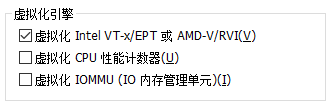

**注意:开启后有可能开机会遇到这个问题**

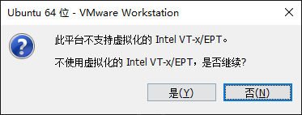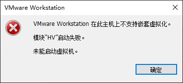

解决方法如下:

**注意这些操作会关掉HYPER-V导致WSL2进不去.**[如何恢复WSL2使用?](#附录A.如果想继续使用WSL,如何恢复使用?)

* 在任务栏搜索"服务",关闭画圈的服务

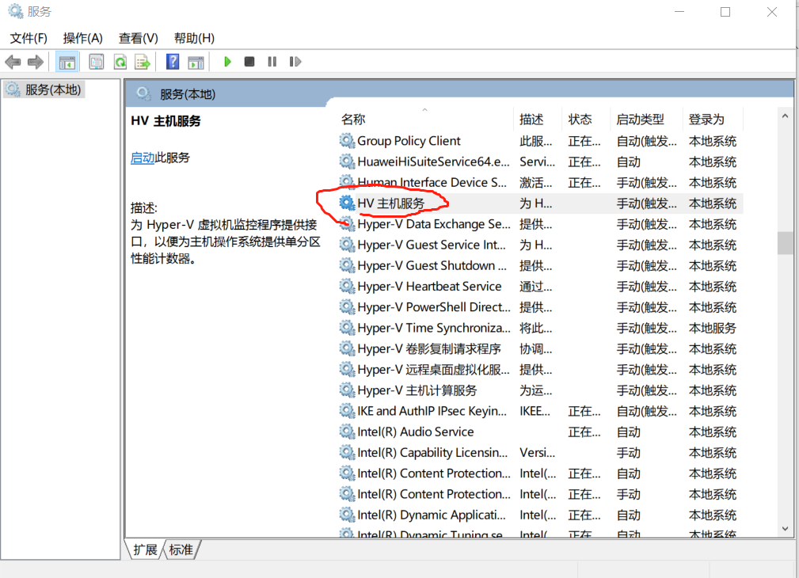

* 进入有管理员权限的Powershell这样做

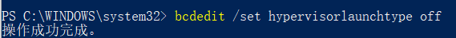

解决问题以后就可以开始安装了

* 如果不想安装慢死就这样做,虽然总体上还是慢的

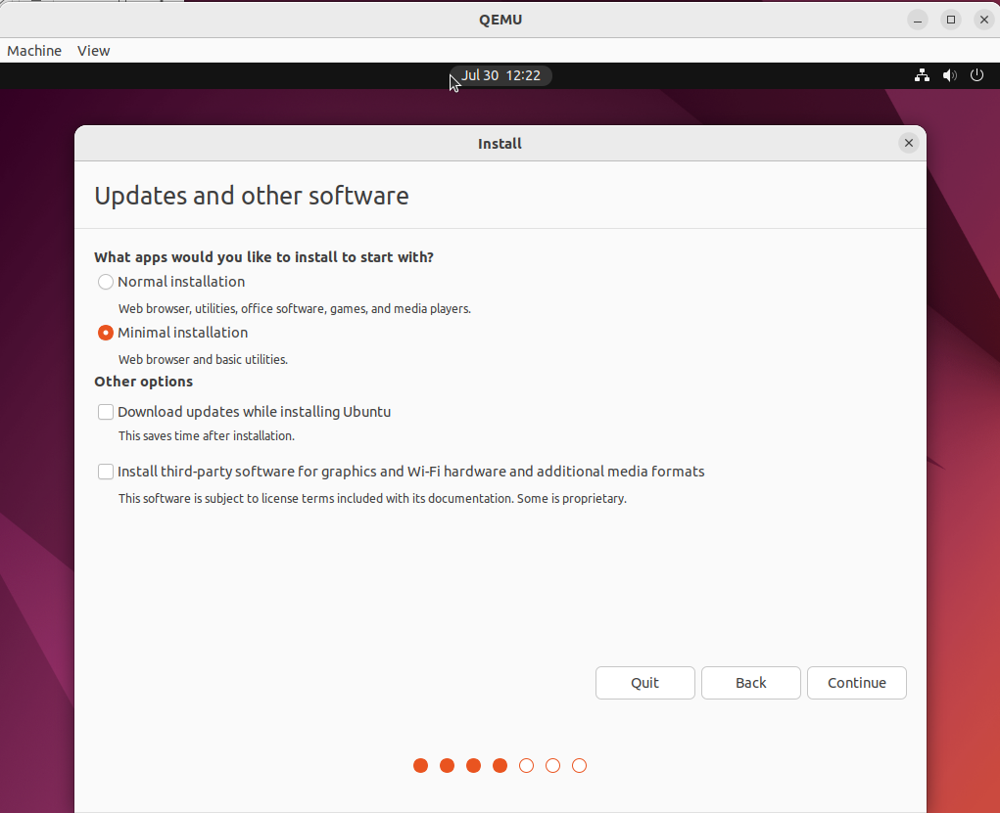

### 3、QEMU网络配置

QEMU有多种网络模式,默认的是user模式,它可以连接到外部网络,但是并不能被外部网络看见,就不能ssh进去.所以我们需要使用其他网络模式,比如tap模式

先在宿主机创建一个网卡

**这一步在后面步骤全部完成以后,如果重启宿主机,效果可能会消失,所以重启后要重新输入以下三条命令**

且这个子网的编号是自己指定的,可以与此处不同

```shell
sudo ip tuntap add dev tap0 mode tap
sudo ip link set dev tap0 up
sudo ip address add dev tap0 192.168.2.128/24
```

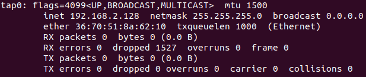

关闭QEMU并使用以下命令重新进入

```shell
sudo qemu-system-x86_64 -enable-kvm -m 3G -smp 2  -drive file=./ubuntu22.img -serial tcp::4444,server=on,wait=off -net nic -net tap,ifname=tap0,script=no,downscript=no -device vhost-vsock-pci,guest-cid=123 
```

但是会出现这个问题

```shell
qemu-system-x86_64: -net tap,ifname=tap0,script=no,downscript=no: could not configure /dev/net/tun (tap0): Operation not permitted
```

再这样做

```shell
sudo setcap CAP_NET_ADMIN=ep /usr/bin/qemu-system-x86_64
```

到这个时候QEMU内部还是连不上外面的,我们按照以下步骤,设置静态IP,配置路由表

* 首先再宿主机打开ip转发.输入以下命令

```bash
sudo gedit /etc/sysctl.conf
```

* 然后把加方框的一行的注释取消,**注意这一步需要重启才能生效**

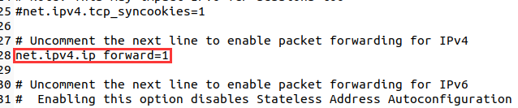

* 然后给客户机的网卡配置ip地址,**注意要和宿主机的tap0的ip地址在一个网段**
  * ens3是网卡的名字,可以`ifconfig`或者`ip addr`来看

```bash
ip addr add 192.168.2.114/24 dev ens3
sudo ip link set ens3 up #可能不需要,甚至可能这样一操作反而上一步白做了,这个时候重新做上一步
```

* 对客户机进行网络设置,配置静态IP
  * 注意Address填写前面给客户机分配的地址,Gateway填宿主机tap0的IP地址

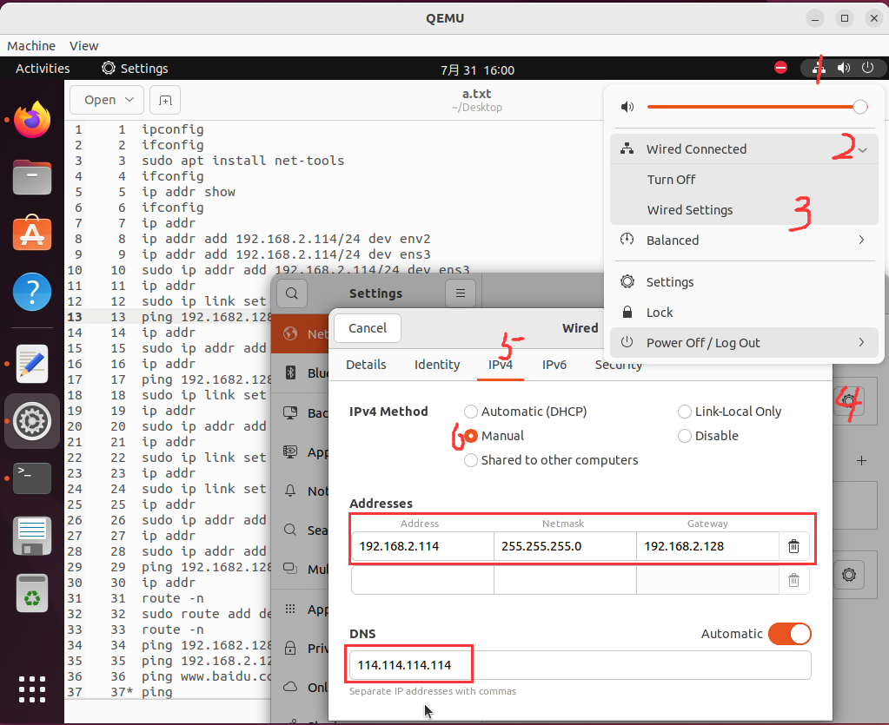

* 配置宿主机路由表,先输入以下命令查看路由表情况

```shell
route -n
```

* 如果有红框所示的内容,就不用管,否则输入以下命令

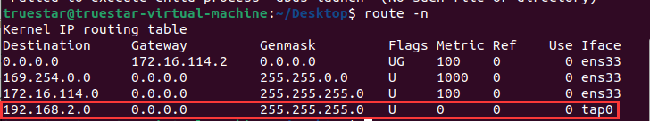

```shell
sudo route add -net 192.168.2.0 netmask 255.255.255.0 dev tap0
```

* 开启宿主机的防火墙的相关功能,实现NAT,并持久化之.
  * 含义是,来自 192.168.2.0/24，且从 ens33 出去的包，要进行 NAT，同时会对返回的包进行 NAT

```shell
sudo iptables -t nat -A POSTROUTING -s 192.168.2.0/24 -o ens33 -j MASQUERADE
sudo apt install iptables-persistent
sudo netfilter-persistent save
```

* 最后把用户机路由表看一下

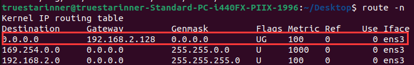

* 红框所示的内容多半是没有的,我们添加之

```shell
sudo route add default gw 192.168.2.128 dev ens3
```

* 这样就可以用了.然后就可以和上文一样配置ssh

### 4、安装序列化库cereal

`cereal`文件夹已经被放在`include`文件夹了,可以直接使用,无需额外操作

* 如果在其他项目中也想使用,可以将`cereal`文件夹移动到`/usr/include`文件夹中


## 三、环境可用性测试

### 1、一个简单的测试框架

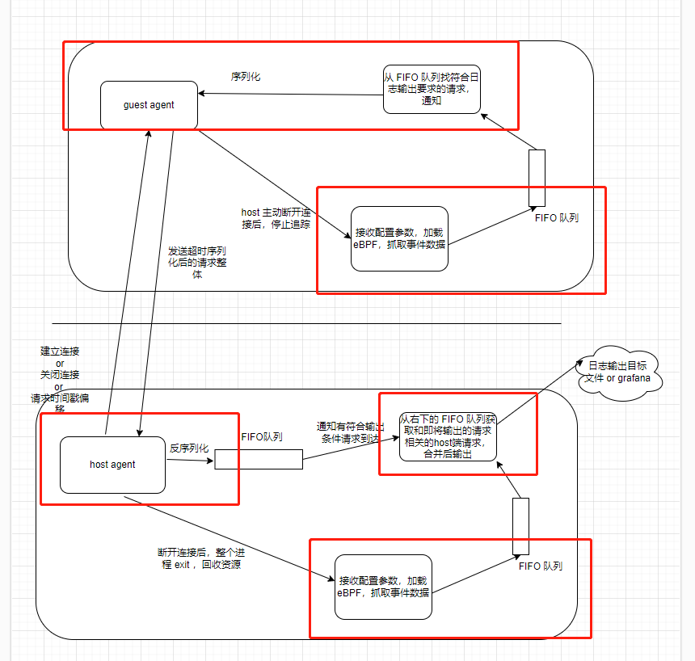

根据实际需要,我们的host端分为三个线程,guest端分为两个线程.划分如图所示

```c++
namespace HostThread
{
    void connect();
    void hook();
    void visualize();
};


namespace GuestThread
{
    void connect();
    void hook();
};
```


* `hook`是获取tracing信息以及传送给其他有关模块的函数,demo中使用每隔随机的时间,随机生成的办法.使用时肯定要根据需要进行修改
* connect函数提供连接的功能,负责创建连接.
  * host的connect还负责接收guest发过来的消息,分为对时钟的消息(调用`getDeltaHelper`)和把tracing信息放入相应队列(并发安全有保证)
  * guest的connect负责定期发起对时钟请求,把tracing信息取出,校正时间和发送到host.注意对时钟的时间限制可以通过修改`TIMEOUT`(单位ns)来指定
* visualize是可视化函数,执行可视化任务,本demo就直接输出到控制台了.且每次看远端和本地队列中哪一个时间戳早就先可视化哪一个
  * 注意,我们的messageexp只有一个时间戳.当把队列元素修改以后,如果是区间,可以比较结束时间


### 2、如何运行这个测试

* 安装cereal.确保cereal文件夹被放在这个文件夹或者`/usr/include`中
* 进入`envtest`文件夹
* `sudo bash build.sh`编译.如果提示缺少依赖,请自行安装
* 用`scp`命令或者借助vscode等把可执行文件`client`移动到guest(QEMU)中
    * 如果是在虚拟机中,用vscode中转时经过了Windows物理机,移动到QEMU之后要`chmod +x ./client`恢复权限
* 在host(本机)运行server
* 在guest(QEMU)运行client
* 如果运行失败,很可能是QEMU启动的时候忘记添加vsock设备,请检查命令
* 如果运行成功会见到下图所示,左侧是单调时钟的时间戳(单位ns),右侧是随机字符串(长度不大于65)

[试一下你的vsock和cereal安装是否正常吧](../envtest/README.md)

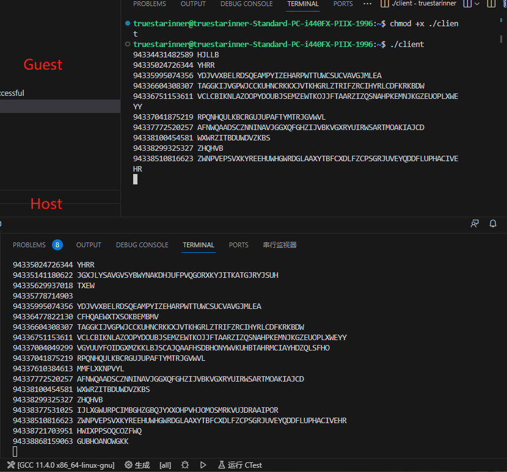

### 3、将这个测试运用到tracing中

该测试框架虽然简陋,但是能够判断vsock和cereal的工作状态.且已经反映了Tracing中各个进程之间的通信方式
仅仅需要将其中"随机产生Tracing"的模块改为真实的eBPF最终模块,打印模块换成可视化模块(向Grafana发信息)
就可以实现Tracing功能了

## 附录A、如果想继续使用WSL,如何恢复使用?

我执行了以下三个操作,但是到底哪一步有用,难以验证.可能是其某一个非空子集实际起到作用

当然,这样执行以后嵌套虚拟化将无法使用.

* 第一个,开启windows功能`Hyper-V`

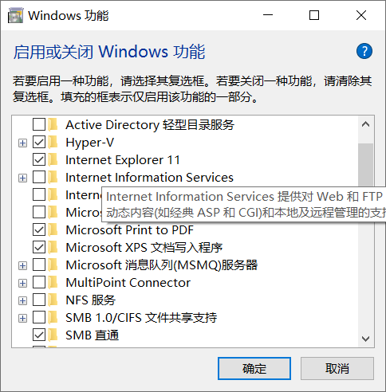

* 第二个,在有管理员权限的Powershell输入以下命令(我猜没啥用)

```shell
dism.exe /online /enable-feature /featurename:VirtualMachinePlatform /all /norestart
```

* 第三个,在有管理员权限的Powershell输入以下命令(我感觉这一步作用比较大)

```shell
 bcdedit /set hypervisorlaunchtype Auto
```

## 附录B、vsock通信框架使用方法

如果希望在自己的程序中使用这一套vsock传输框架,可以阅读本章

### 1、对需要传输的类进行序列化

使用例`testcase.h`针对STL,智能指针和继承的情况进行了举例.简单来讲有以下原则

* 基本数据类型都可以序列化
* 能使用该序列化库的数据结构可以查看`cereal/types`,里面有的都可以直接用.主要有大部分的STL,智能指针,chrono,atomic等
* 普通指针是不能用的
* 不包含普通指针的自定义结构体,需要实现serialize函数模板如下,其中archive里面的是该结构体的所有成员.如果没有继承的情况,如下:

```c++
template<class Archive>
void serialize(Archive & archive)
{
   archive(strvec,data); 
}
```

* 如果存在继承,如下,其中example1是基类名.如果继承自多个基类,每个基类都需要这么做

```c++
void serialize( Archive & ar )
{  
    ar( cereal::base_class<example1>( this ), ptr ); 
}
```

* 如果存在多态,比如存在基类Base和派生类Derived1和Derived2,那么需要在头文件末尾这样声明

```c++
//注册派生类(基类不用注册)
CEREAL_REGISTER_TYPE(Derived1);
CEREAL_REGISTER_TYPE(Derived2);

// 声明基类和派生类关系
CEREAL_REGISTER_POLYMORPHIC_RELATION(Base, Derived1);
CEREAL_REGISTER_POLYMORPHIC_RELATION(Base, Derived2);
```

* 几个例子详见`src/include/testcase.h`

### 2、为需要传输的类添加辅助函数

因为受到宏定义的限制,需要修改三处,都在`mesgtype.h`中

* 修改TYPES的值,并将类名添加到TYPE_DEF辅助宏中

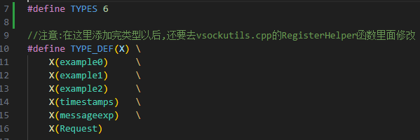

* 如果新的类在新的头文件定义,那么在包含对应的头文件

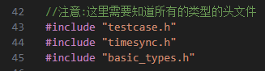

* 在`REGISTER_MANY_HELPERS`宏添加对应类名和标号


### 3、发送/接收数据

我们已经将启动连接,关闭连接,序列化与反序列化等一系列功能进行了封装,成为一个类.只需要一套简单的send/recv操作,就可以实现数据的收发

注意到客户端和服务器可以互相发送数据

我们实现了`ClientEngine`和`ServerEngine`两个类,都继承自`VSockEngine`基类.只需要调用默认构造函数就可以把连接设置好,唯一需要注意的是服务器必须比客户端先启动.

要发送消息,需要调用`sendMsg`方法.其参数为

```c++
int sendMesg(enum Type type,void * obj);
```

* 将该消息的类型和地址传入,可以以阻塞式的方法向对侧发送数据.
* 类型名称为`TYPE_`加上类名,比如`Example`类的类型名称就是`TYPE_example`
* 返回值是系统的send函数返回值

要接收消息,需要调用recvMsg方法,其参数为

```c++
int recvMesg(enum Type & type,void *& obj);
```

* 需要传入一个Type的引用和一个空指针(用来承接对象地址),函数执行后,type就是类型,obj指向一块动态内存区域,存储接收到的对象
* 返回值是系统的recv函数返回值
* 该函数也是阻塞式的,如果没有收到任何信息,会阻塞直到收到信息


该发送/接受框架对于小消息可以直接一次发送,大消息需要分两次发送,第一次发送消息的大小和类型,第二次发送消息内容.这个阈值可以在`mesgtype.h`中的`SMALL_MESG_LIMIT_BYTES`设置,单位是字节,需要是4的倍数


### 4、时钟同步

因为guest和host的时钟未必同步,所以我们需要对guest的时钟进行修正

我们假设,传输同样的数据,guest发给host和host发给guest时间大致相同(对于vsock,因为不是真正走WAN,所以大体上可以保证这一点)


$$
T'_1-T_1=t_{trans}-\Delta t\\
T_2-T'_2=t_{trans}+\Delta t\\
2\Delta t=T_2-T'_2+T_1-T'_1\\
\Delta t=\frac{T_2-T'_2+T_1-T'_1}{2}
$$
如此便算出了(本机时间-远端时间)的值.对时钟的请求既可以由host发出,又可以由guest发出

调用`getDelta`方法,可以获取这个差值

与此同时,在另一端需要设置,当收到`TYPE_timestamps`类型数据时,调用`getDeltaHelper`方法帮助时钟同步

时钟同步功能使用的是单调时钟,防止调时间,闰秒等因素造成对钟失败

## 参考资料

[Linux 内核调试 七：qemu网络配置_lqonlylove的博客-CSDN博客](https://blog.csdn.net/OnlyLove_/article/details/124536607)

[qemu虚拟机配置网络_qemu 配置网络_千墨的博客-CSDN博客](https://blog.csdn.net/jcf147/article/details/131290211)

[cereal Docs - Main (uscilab.github.io)](https://uscilab.github.io/cereal/index.html)
