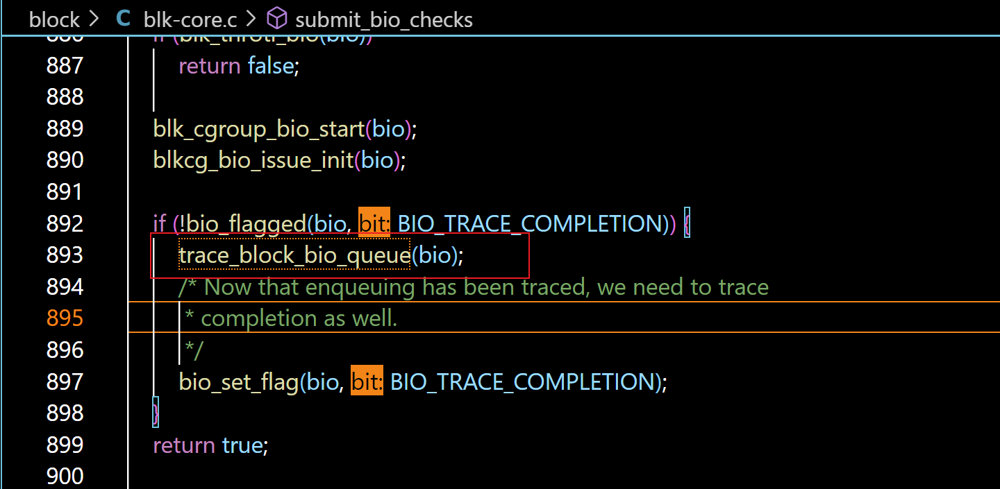
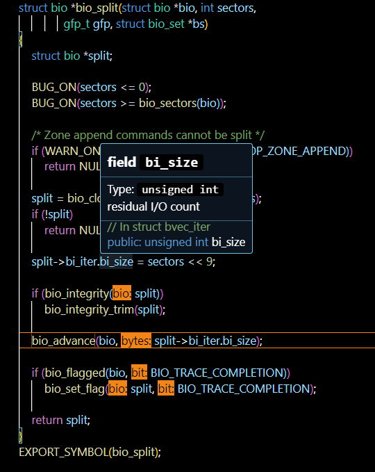
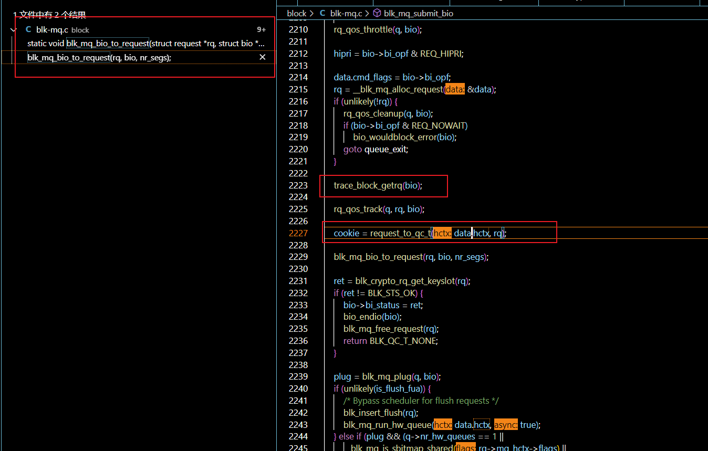

# block layer 关键挂载点语义分析

本文档挂载点都在[这里](../src/iotrace.bpf.c)

## syscall__read
这个挂载点在触发系统调用read的时候生效

```c
size_t read(int flides, void *buf, size_t nbytes);
```

read系统调用的作用是从一个文件描述符对应的文件中,读取一定长度的内容到指定的缓冲区
这是非常常见的系统调用,意味着一个读请求正式进入了内核

## syscall__write
这个挂载点在触发系统调用write的时候生效

```c
size_t write(int flides, const void *buf, size_t nbytes);
```

write系统调用的作用是将缓冲区内一定长度的内容写到某个文件描述符对应的文件中
这意味着一个写请求正式进入了内核

## syscall__pread64
这个挂载点在触发系统调用pread64的时候生效

```c
ssize_t pread64(int fd, void *buf, size_t count, off64_t offset);
```

pread64系统调用的作用是从一个文件描述符对应的文件中,从某个特定偏移量,读取一定长度的内容到指定的缓冲区
可以指定偏移量的设计在多线程程序中有很好的作用

## syscall__pwrite64
这个挂载点在触发系统调用pwrited64的时候生效

```c
ssize_t pwrite64(int fd, const void *buf, size_t count, off64_t offset);
```

pwrite64系统调用的作用是从指定的缓冲区,写入一定长度的内容,到一个文件描述符对应的文件从某个特定偏移量开始的位置

## syscall__readv
这个挂载点在触发系统调用readv的时候生效

```c
ssize_t readv(int fd, const struct iovec *iov, int iovcnt);
```

readv系统调用的作用和read类似,但是可以一次读取多个缓冲区,每个缓冲区有独立的首地址和长度
* 所以又被称为分散读

## syscall__writev
这个挂载点在触发系统调用writev的时候生效

```c
ssize_t writev(int fd, const struct iovec *iov, int iovcnt);
```

writev系统调用的作用和write类似,但是可以一次写多个缓冲区,每个缓冲区有独立的首地址和长度
* 所以又被称为集中写

## syscall__preadv
这个挂载点在触发系统调用preadv的时候生效

```c
ssize_t preadv(int fd, const struct iovec *iov, int iovcnt,  off_t offset);
```

preadv系统调用类似于readv和pread64的结合,既可以读多个缓冲区,又可以指定偏移量

## syscall__pwritev
这个挂载点在触发系统调用pwritev的时候生效

```c
ssize_t pwritev(int fd, const struct iovec *iov, int iovcnt,  off_t offset);
```

pwritev系统调用类似于writev和pwrite64的结合,既可以写多个缓冲区,又可以指定偏移量

## syscall__fsync
这个挂载点在触发系统调用fsync的时候生效

```c
int fsync(int fd); 
```

fsync把fd对应的文件数据以及文件属性信息（inode等信息）写入到磁盘，并且等待写磁盘操作完成后而返回。
应用程序一般都是通过调用fsync确保修改过的数据能够立即写入到磁盘上

## syscall__fdatasync
这个挂载点在触发系统调用fdatasync的时候生效

```c
int fdatasync(int fd);
```

和fsync类似,但是只更新数据,不更新元数据

## syscall__sync_file_range
这个挂载点在触发系统调用sync_file_range的时候生效

```c
int sync_file_range(int fd, off64_t offset, off64_t nbytes, unsigned int flags);
```

这一系统调用对文件的一个区间执行一些同步操作.具体操作由flags决定

## fs__do_iter_read
本函数位于`fs/read_write.c`

```c
ssize_t do_iter_read(struct file *file, struct iov_iter *iter, loff_t *pos, rwf_t flags)
```

被`vfs_readv`调用的函数,用以辅助实现分散读


## fs__do_iter_write
本函数位于`fs/read_write.c`

```c
ssize_t do_iter_write(struct file *file, struct iov_iter *iter, loff_t *pos, rwf_t flags)
```

被`vfs_writev`调用的函数,用以辅助实现集中写
值得一提的是,这俩函数都会调用`do_iter_readv_writev`,然后再去调`call_write_iter`或者`call_read_iter`
而它们在`include/linux/fs.h`里面

## fs__vfs_iocb_iter_write
本函数位于`fs/read_write.c`

```c
ssize_t vfs_iocb_iter_write(struct file *file, struct kiocb *iocb, struct iov_iter *iter)
```

和`do_iter_write`相似,但是由于iocb直接给出,可以直接调用`call_write_iter`而不需要再去获取,调用`do_iter_readv_writev`

## fs__vfs_iocb_iter_read
本函数位于`fs/read_write.c`

```c
ssize_t vfs_iocb_iter_read(struct file *file, struct kiocb *iocb, struct iov_iter *iter)
```

和`do_iter_read`相似,但是由于iocb直接给出,可以直接调用`call_read_iter`而不需要再去获取,调用`do_iter_readv_writev`

## fs__vfs_read
本函数位于`fs/read_write.c`

```c
ssize_t vfs_read(struct file *file, char __user *buf, size_t count, loff_t *pos)
```

这个函数可以被外界所访问,接口和read函数一一对应,意味着读请求进入了文件系统的vfs层次
也存在诸如`vfs_readv`之类的版本,但是我们没有使用到这些挂载点

## fs__vfs_write
本函数位于`fs/read_write.c`

```c
ssize_t vfs_write(struct file *file, const char __user *buf, size_t count, loff_t *pos)
```

这个函数可以被外界所访问,接口和write函数一一对应,意味着写请求进入了文件系统的vfs层次
也存在诸如`vfs_writev`之类的版本,但是我们没有使用到这些挂载点

## fs__vfs_fsync_range
本函数位于`fs/sync.c`

```c
int vfs_fsync_range(struct file *file, loff_t start, loff_t end, int datasync)
```

这个函数用以在vfs层同步某文件某个范围内的数据更改(可能包括元数据更改,由datasync决定)
也有同步全文件更改的`vfs_fsync`函数,但是最终还是调用了这个函数   

## fs__generic_file_read_iter
本函数位于`fs/read_write.c`

```c
ssize_t generic_file_read_iter(struct kiocb *iocb, struct iov_iter *iter)
```

`vfs_read`会调取文件的读取函数(`file->f_op->read_iter`),而大部分文件的读取操作类似,所以就提供了通用的读取函数
进入该函数以后,会分流Direct I/O和普通的I/O,进行后续处理

## fs__generic_file_write_iter
本函数位于`fs/read_write.c`

```c
ssize_t generic_file_write_iter(struct kiocb *iocb, struct iov_iter *iter)
```

`vfs_write`会调取文件的写入函数(`file->f_op->write_iter`),而大部分文件的写入操作类似,所以就提供了通用的写入函数
进入该函数以后,会分流Direct I/O和普通的I/O,进行后续处理


## fs__filemap_get_pages
本函数位于`mm/filemap.c`

```c
int filemap_get_pages(struct kiocb *iocb, struct iov_iter *iter, struct pagevec *pvec)
```

本函数作用是页面映射.是将一些读写请求映射到对应的页面去

## fs__file_write_and_wait_range
本函数位于`mm/filemap.c`

```c
int file_write_and_wait_range(struct file *file, loff_t lstart, loff_t lend)
```

本函数的作用是在vfs层,保证文件的写入和元数据更新已经完成

## iomap__dio_rw
有2个相关函数,都位于`fs/iomap/direct-io.c`,第一个里面调用第二个

```c
ssize_t iomap_dio_rw(struct kiocb *iocb, struct iov_iter *iter,
		const struct iomap_ops *ops, const struct iomap_dio_ops *dops,
		unsigned int dio_flags, size_t done_before)
struct iomap_dio * __iomap_dio_rw(struct kiocb *iocb, struct iov_iter *iter,
		const struct iomap_ops *ops, const struct iomap_dio_ops *dops,
		unsigned int dio_flags, size_t done_before)
```

这些函数与Direct I/O读写有关.第二个函数负责去实际上执行读写任务.包括缓冲区申请,向设备发送请求,执行读写,并保证完成
第一个函数除了调用第二个函数,还要负责检查dio读写是否成功了,如果失败了要报告相应错误信息

## sched__switch
这是一个tracepoint,相关函数位于`kernel/sched/core.c`

```c
static void __sched notrace __schedule(unsigned int sched_mode)
```

这是一个大调度器,用来按照设置好的某种调度方法进行调度
每次调度发生后触发该tracepoint

## pagecache__delete_from_page_cache
这是一个tracepoint,有2个相关函数,都位于`mm/filemap.c`,第一个调用第二个

```c
void delete_from_page_cache(struct page *page)
void __delete_from_page_cache(struct page *page, void *shadow)
```

有可能其它进程把这个 page 给删除了，所以这里需要记录
将某个页面从页面缓存中移除出去.
第一个函数除了调用第二个函数,还负责上锁保护和释放页面缓存
第二个函数负责从映射表里面删除有关的信息,调用这个tracepoint,亦会负责写回等

还有一个位于同一文件的函数也调用该tracepoint

```c
void delete_from_page_cache_batch(struct address_space *mapping,
				  struct pagevec *pvec)
```

这是一次删除一组的

## pagecache__add_to_page_cache

以下一个函数,位于`mm/filemap.c`,调用了这个tracepoint
```c
int __add_to_page_cache_locked(struct page *page, struct address_space *mapping,
		pgoff_t offset, gfp_t gfp, void **shadowp)  
```

有2个相关函数,也位于`mm/filemap.c`,都会调用以上函数

```c
int add_to_page_cache_locked(struct page *page, struct address_space *mapping,
		pgoff_t offset, gfp_t gfp_mask)             //1
int add_to_page_cache_lru(struct page *page, struct address_space *mapping,
		pgoff_t offset, gfp_t gfp_mask)             //2

```

将某个页面增加到缓存中
1直接调用,完全没有别的操作.必须事先保证这个页面已经上锁.
2更加常见.除了调用它,还做了页面上锁,LRU置换等操作.函数退出时未必保证解锁.

## pagecache__mark_page_accessed
本函数位于`mm/swap.c`

```c
void mark_page_accessed(struct page *page)
```

顾名思义,作用是将缓存标记为已经访问过,只记录当前追踪的线程对page的访问情况

## pagecache__writeback_dirty_page

以下一个函数,位于`mm/page-writeback.c`,调用了这个tracepoint

```c
void account_page_dirtied(struct page *page, struct address_space *mapping)
```

一个标记脏页面的Helper函数
这个函数被位于同一个文件的以下函数调用

```c
void __set_page_dirty(struct page *page, struct address_space *mapping,
			     int warn)
```

该函数的作用是将页面标记为脏,并在页面缓存中设置.并把inode标记为脏的
* 它被本文件中各种与设置脏页面的函数调用,这里不在赘述

## block_bio_queue



BIO_TRACE_COMPLETION 的作用是什么？

具体的触发条件描述如下：

无论是上层还是下层驱动发起的 bio 请求，只有经过 trace_block_bio_queue 的 bio 请求，才有可能进入到后续流程被处理。

## block_bio_bounce

一般驱动中不会出现这种情况，主要针对内核中无法容纳的页存储，可以暂时不用考虑。
可以很好反映性能的事件，需要额外的数据拷贝和内存申请

## block__bio_add_to_rq

这一类(也即block后面加两道下划线的)函数都在`block/blk-rq-qos.c`,这意味着请求包含了Quality of Service(QoS)属性.QoS可以对请求按照一定的优先级进行排序和资源分配(根据进程的ionice),保证较好的服务质量

这意味着一个bio请求被加入到请求队列中

## block__bio_done

这意味着bio请求被完成了

## block__bio_throttle 

这意味着一个bio请求被强行中止了

## block_split

原理简述：首先克隆一个 bio，但会继承 BIO_TRACE_COMPLETION 标志，即 split 出的 bio 也会被追踪。接着修改 bi_iter 的起始扇区和扇区数。bvec 不会被拆分，仍然位于最初的 bio 中。

trace 到的参数是分割后的新 split bio，可以追踪到，但不会进入 submit_bio_noacct，因此只有最初的父 bio 会被 block_bio_queue 捕获。

一个 block 在 split 之后，会将新 split 的 bio 添加到原来 bio 的链表中。

原来 bio 的更改：

- bi_iter 中的扇区数
- 添加一个 BIO_CHAIN 标志
- remaining 增加 1

新 bio ：

- 继承 BIO_TRACE_COMPLETION 标志
- 通过遍历 bi_parent，可以找到最初的父 bio
- bio 的 bio_end_io 回调函数变为 bio_chain_endio

结合 bio_endio，可以总结出：一个 bio 可能被 split 成多个 bio，新 bio 是旧 bio 的低地址部分，但这些 bio 都是链在原始 bio 后面的。新 bio 不会被重新提交，但会继承 BIO_TRACE_COMPLETION，因此可以被追踪到。如果认为一个原始 bio 和其子 bio 都是随机提交 bio_endio 的，那么原始 bio 提交时不一定马上调用 bio_end_io 真正执行结束逻辑。子 bio 完成后会继续处理父 bio。子 bio 的完成会先于父 bio，每次到 bio_endio 开始判断时，原始 bio 的 remainder 会减一，直到所有子 bio 都完成。但每个 bio 只会触发一次 bio_endio，并且会被记录下来。

一个 bio_split 出的新 bio 不会包含 bvec。

那么如何判断这个子 bio 与哪些 IOrequest 相关？如何获得这个子 bio 对应的 bvec？

通过分析 bio_split 函数：


其中 bio_advance 的作用是根据 split->bi_iter.bi_size 修改 bi_iter.idx。

在变动前后的 idx 值就是新 split 出的 bio 对应的 bvec。

新 bio 的 bi_iter.idx 是 split 前的 idx，通过 split->bi_private->bi_iter.idx 可以得到后续 idx。



## block_bio_frontmerge && backmerge / rq_merge

这两个 trace point 捕获的参数只包括参与了 merge 的 bio，但没有参与 merge 的 request 信息。只是将 bio 添加到 rq 的 bio 链表中，然后更新 rq 的起始扇区号和数值。

rq_merge 只捕获了被 merge 的那个 rq 的信息，但无法知道与之合并的 request 信息。

可以使用 rq_qos_merge 来获取 request 和 bio，但这包括了 discard_merge（这包括了）

## block_getrq

这个 tracepoint 的意义在于捕获参数 bio 正式找到一个 request，并将bio 请求与 request 关联起来。然后，bio 请求会进入 request 队列，等待执行。这意味着 bio 请求已经完成了与 request 的匹配，并且即将被处理。



## block__rq_insert

该tracepoint被调用时,一个block I/O request被放入了请求队列

## block__rq_done

该tracepoint被调用时,block请求彻底完成block层所有任务
**和complete有什么区别?**

## block_rq_issue

当一个 request 被提交到设备队列并等待执行时，`block_rq_issue` tracepoint 会被触发。这意味着 request 已经从 I/O 调度器队列中移除，并且正在等待设备执行。

## block__rq_requeue

请求重新进入了请求队列.可能与优先级变动等有关(**具体还要看看**)

## block_rq_complete

`block_rq_complete` tracepoint 表示 request 已经被设备处理完成。通过这个 tracepoint，我们可以知道 request 的执行状态，例如成功或失败，以及 request 的实际处理时间。

总结一下：
每个 bio 请求都会经过 `block_bio_queue`，然后可能会被拆分成多个子 bio。这些子 bio 可能会与其他 bio 合并。最终，bio 请求会被分配给一个 request 并与之关联。request 会在设备队列中等待执行，最后完成处理。通过使用不同的 tracepoints，我们可以追踪 bio 请求的整个生命周期，从创建到完成。

## nvme__setup_cmd

这是一个tracepoint,触发点位于`drivers/nvme/host/core.c`中

```c
blk_status_t nvme_setup_cmd(struct nvme_ns *ns, struct request *req)
```

目的是设置读写nvme设备的命令,准备送给nvme

## nvme__complete_rq

这也是一个tracepoint,触发点位于`drivers/nvme/host/core.c`中

```c
void nvme_complete_rq(struct request *req)
```

这意味着一次nvme读写已经完成了

## nvme__sq

这还是一个tracepoint,触发点位于`drivers/nvme/host/core.c`中

```c
void nvme_handle_cqe(struct nvme_queue *nvmeq, u16 idx)
```

目的是处理CQE(完成队列项),这会造成一个中断
**这俩到底是谁先谁后啊**

## scsi__dispatch_cmd_start

这是一个tracepoint,触发点位于`drivers/scsi/scsi_lib.c`中

```c
static int scsi_dispatch_cmd(struct scsi_cmnd *cmd)
```

由于这个函数内部包括不止一个触发点,所以需要分别介绍
这一触发点代表命令被分派出去,开始执行


## scsi__dispatch_cmd_error

这个tracepoint和前一个位于同一个函数,意味着命令执行出错

## scsi__dispatch_cmd_done

这是一个tracepoint,触发点位于`drivers/scsi/scsi_lib.c`中

```c
void scsi_mq_done(struct scsi_cmnd *cmd)
```

作用在多队列(MQ)环境下处理SCSI命令的完成

## scsi__dispatch_cmd_timeout

这是一个tracepoint,触发点位于`drivers/scsi/scsi_error.c`中

```c
enum blk_eh_timer_return scsi_times_out(struct request *req)
```

作用是处理超时的scsi请求,将其清理掉

## virtio__queue_rq

本函数位于`drivers\block\virtio_blk.c`

```c

blk_status_t virtio_queue_rq(struct blk_mq_hw_ctx *hctx,
		const struct blk_mq_queue_data *bd)
```

意味着一个virtio的请求进入了相应的队列