# 性能测试报告

### **一、eBPF 程序的性能开销分析思路**

eBPF 程序分为用户态程序和内核态程序两部分，所以对 eBPF 程序的性能开销分析也需要分开两部分讨论：

1. eBPF 用户态程序本身的性能开销

2. 触发挂载点从而执行 eBPF 内核态程序带来的开销

第一点中主要是从内核态获取事件并且进行分析与交互带来的开销，这部分开销直接体现在我们启动的进程的 CPU 与内存占用率上。

第二点中是 eBPF 内核收集程序的开销，包括与 eBPF Map 等数据结构交互读写，访问内核空间数据等开销，这部分开销体现在所有触发 eBPF 内核程序的线程的 CPU 与内存的增长部分。

所以，可以直接从我们的 IOtracer 的主进程还有系统总体的 CPU 占用率以及内存开销在启动程序的前后有多少变化来反映我们的程序带来了多少真正的开销。

## 二、测试环境与配置

### 物理设备环境

Ubuntu 20.04 LTS

内核版本 5.15.0-78-generic

测试物理设备 CPU：8核16线程 AMD Ryzen 7 4800H 内存：24 GB

### 待测试应用配置

本应用名为 IOtracer，存在三种运行模式：

- standalone 模式
- host 模式
- guest 模式

其中 standalone 模式用于追踪 IOtracer 目前处于的 Linux 操作系统环境的 IO 请求，为场景一。

而 host 和 guest 模式分别运行在 qemu/kvm 环境下的 host OS 和 guest OS，把 guest OS 发起的 virtio 请求全流程进行 guest 到 host 的全链路追踪，作为场景二。

IOtracer 支持的内核追踪事件类别有

1. syscall_layer
2. fs_layer
3. sched_layer
4. block_layer
5. nvme_layer
6. scsi_layer
7. virtio_layer

并且在 host 模式下，还支持 qemu 的追踪，称为 qemu_layer。

对于 standalone 模式，默认开启 1 到 7 的事件追踪。

对于 host 模式，默认开启 qemu_layer 关闭 virtio_layer，其它默认开启。

对于 guest 模式，默认开启 virtio_layer 关闭 qemu_layer，其它默认开启。

### 测试工具

使用 fio 工具作为 IO 负载生成工具，使用 fio 可以方便地更改使用的 IO 系统调用、buffer/direct IO 模式的切换，以及可以很好控制 iops。

使用 sar 系统性能分析工具来统计程序开销，sar 主要关注全系统 CPU 占用率。

使用 htop 工具查看 IOtracer 用户态程序的 CPU 占用率情况，用于辅助分析。

## 三、测试与结果分析

首先，我们用 **fio 营造每秒1.2万读iops和250写iops的测试环境**，包括了单线程读单线程写，12 线程读单线程写的测试。

在保证 iops 一致时，对于 eBPF 程序来说，多线程触发会导致内核事件对 ringbuffer 的并发写入开销增大，导致 CPU 占用率提高。

内存占用，在场景一，存在两个线程，总共占用 2MB，并且随着 IO 的处理不会出现大波动。


在场景二，host 部分的内存占用如下,总共占用 47 MB 左右，**相比场景一占用内存多这么多是因为存在数据序列化和反序列化的问题。**

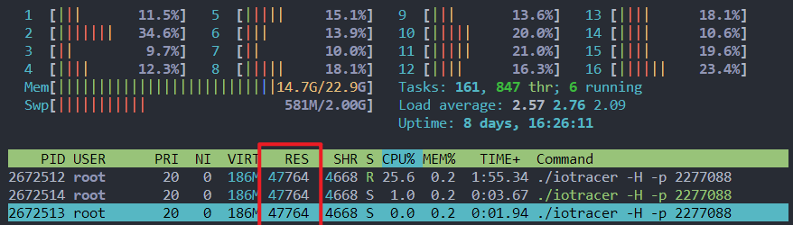

guest 部分占用如下，占用 14 MB 左右

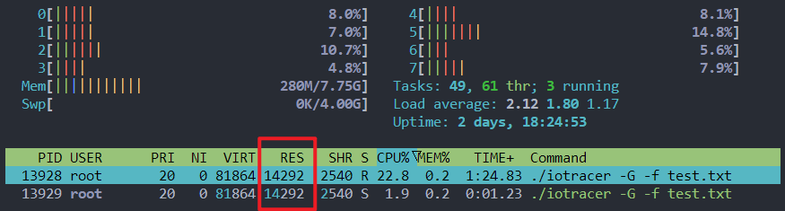

下表时对各种情况下，系统 CPU 平均负载的记录。

在场景一中，除了多线程高并发的 direct IO 时的全系统 CPU 开销是超过 5% 每核的，所以**说明我们的 standlone 模式可以比较好控制开销，满足常态化部署的条件。**

可以看到场景二目前还无法很好地控制开销，原因主要是 guest OS 的过滤信息没办法很好地传递到 host OS，导致 host 端完全采集了所有的 virtblk 事件，导致开销过大。并且在场景一的基础上出现 vsock 带来的传输开销以及序列化反序列化的开销，所以总的来说开销仍然较大，**即我们的 virtio 全链路追踪目前只实现了技术原型，但是开销没办法很好控制。**

| read iops=12k/write iops=250   | 场景一，无 IOtracer | 场景一，有 IOtracer | 场景二，无 IOtracer | 场景二，有 IOtracer（host and guest） |
| ------------------------------ | ------------------- | ------------------- | ------------------- | ------------------------------------- |
| direct IO （顺序读写）         | 94.65%              | 91.06%              | 92.43%              | xx                                    |
| direct IO （随机读写）         | 92.87%              | 91.06%              | 94.05%              | xx                                    |
| buffered IO (顺序读写)         | 97.75%              | 92.85%              | 92.40%              | xx                                    |
| buffered IO (随机读写)         | 92.86%              | 91.39%              | 91.20%              | xx                                    |
| 12个读线程1个写线程 （direct） | 87.984%             | 81.8875%            | 90.54%              | 71.66%                                |
| （buffered)                    | 97.17%              | 94.21%              | 89.81%              | 72.32%                                |

### 场景一

#### direct IO （sequential readwrite）

下面同时运行下列两个 fio 命令，用于营造这个测试环境

```shell
fio --ioengine=psync --direct=1 --runtime=1000s --rate_iops=250 --thread=1 --numjobs=1 --readwrite=write   --name=fiotest --filename=testfile --size=3G

fio --ioengine=psync --direct=1 --runtime=1000s --rate_iops=12000 --thread=1 --numjobs=1 --readwrite=read   --name=fiotest --filename=testfile --size=3G
```

运行 IOtracer 前的系统开销为每核 5.5% CPU 占用率

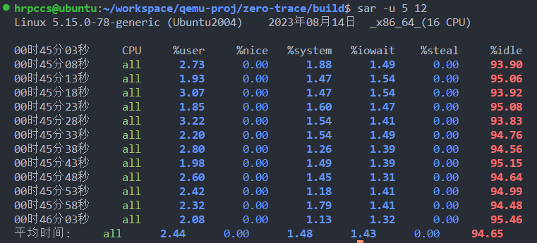

运行 IOtracer 后的，系统开销为每核 9% 占用率，所以得到 **IOtracer 带来的系统开销为每核 4.5%**。实际测试过程可看附录。

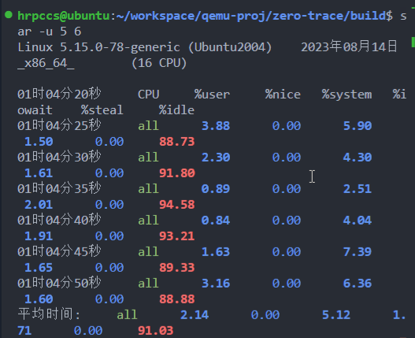

#### direct IO （random readwrite)

```shell
fio --ioengine=psync --direct=1 --runtime=1000s --rate_iops=250 --thread=1 --numjobs=1 --readwrite=randwrite   --name=fiotest --filename=testfile --size=3G

fio --ioengine=psync --direct=1 --runtime=1000s --rate_iops=12000 --thread=1 --numjobs=1 --readwrite=randread   --name=fiotest --filename=testfile --size=3G
```

从下面先后是没有开启 IOtracer 和开启了 IOtracer 的开销对比，可以得到 IOtracer 的性能开销为 1.8% 每核。

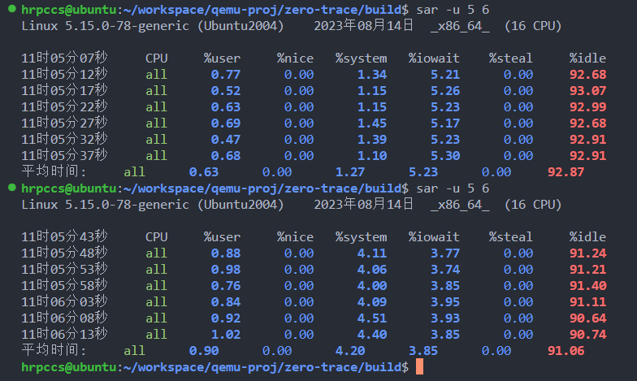

#### buffered IO（sequential readwrite）

```shell
fio --ioengine=psync --buffered=1 --runtime=1000s --rate_iops=250 --thread=1 --numjobs=1 --readwrite=write   --name=fiotest --filename=testfile --size=3G

fio --ioengine=psync --buffered=1 --runtime=1000s --rate_iops=12000 --thread=1 --numjobs=1 --readwrite=read   --name=fiotest --filename=testfile --size=3G
```

会发现 buffered IO 场景下，同样的 iops，开销只有 2.25% 左右的 CPU 占用率

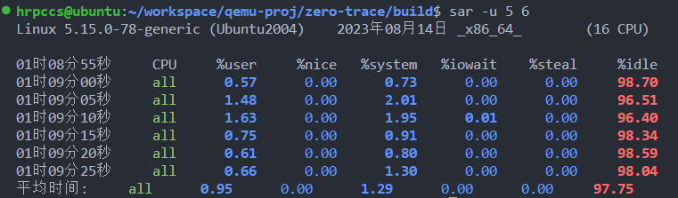

启动 IOtracer 后，系统 CPU 占用率为每核 7.15%，**所以判断 IOtracer 带来的系统开销为4.85% 每核**。

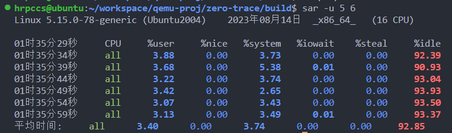

#### buffered IO（random readwrite）

```shell
fio --ioengine=psync --buffered=1 --runtime=1000s --rate_iops=250 --thread=1 --numjobs=1 --readwrite=randwrite   --name=fiotest --filename=testfile --size=3G
fio --ioengine=psync --buffered=1 --runtime=1000s --rate_iops=12000 --thread=1 --numjobs=1 --readwrite=randread   --name=fiotest --filename=testfile --size=3G
```

启动 IOtracer 之前，系统开销为每核 7.24%。

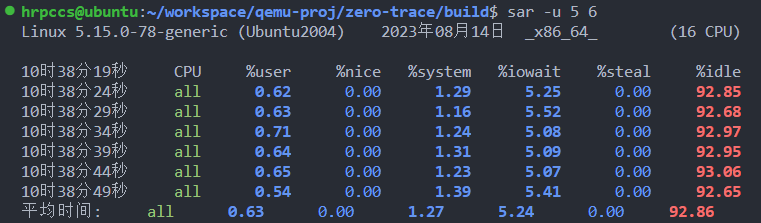

启动 IOtracer 之后，系统开销为 8.6%，可以得到 IOtracer 带来的开销为 1.4% 每核。

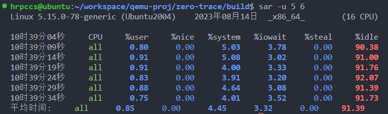

### 场景二

在 host 端以 Host 模式启动对 qemu 进程的监控。

在 guest 端以 Guest 模式启动对 test.txt 的监控。

然后在 guest 端运行 fio 生成 12 个读线程，1个写线程的 12k read iops，250k write iops 的环境。

在 host 端运行 sar 工具统计系统 CPU 占用率开销。

可以得到无论是 direct IO 还是 buffered IO 的开销都是 71.66% 左右，通过对照，得到整个追踪开销在每核 20% 左右。

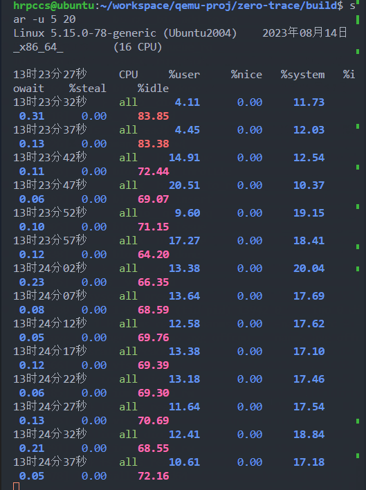

# 附录

## 场景一，directIO 开销测试

顺序读写

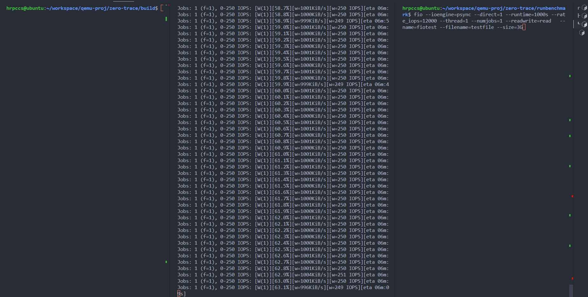

随机读写

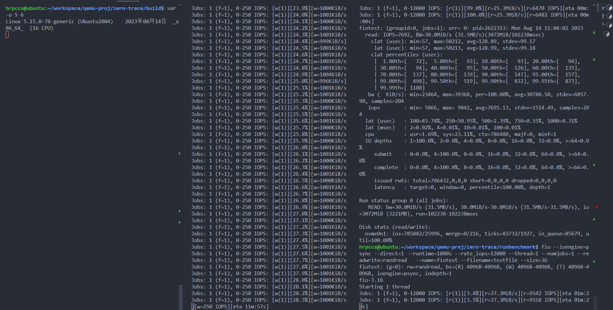

## 场景一，bufferedIO 开销测试

顺序读写

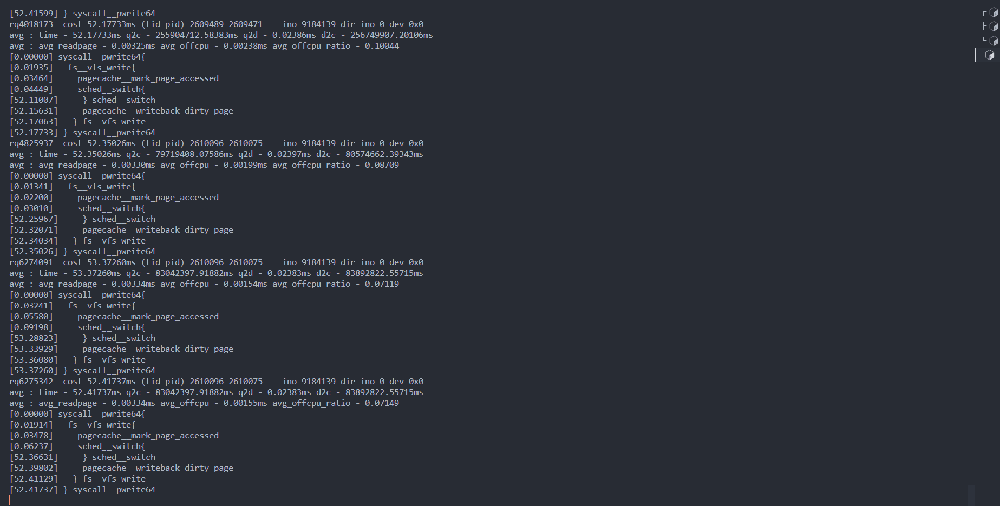

随机读写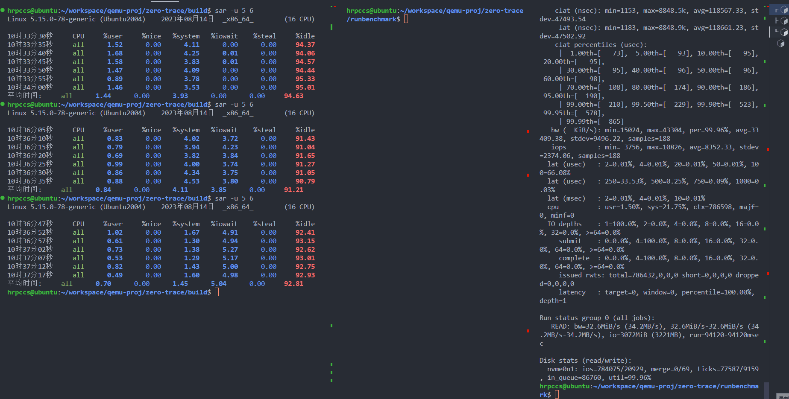

## 场景二开销测试

