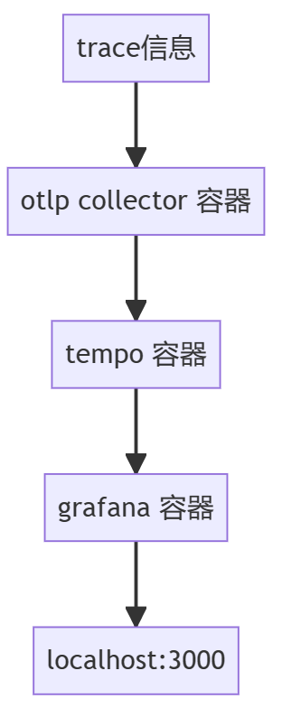

# 重要进展

我们的任务可以分为三个部分：前端（可视化）、中端（数据分析处理）和后端（数据收集）。下面分别说明。

## 前端

前端的任务是将经过处理的嵌套结构的追踪数据发送到Grafana后端。这个任务的难点主要包括两个方面：首先是网络处理，即如何与Grafana建立连接；其次是如何将数据转化为Grafana所支持的格式。

**网络连接**

网络连接的示意图如下：

在网络部分，取得了以下主要进展：

1. 发现了名为 [xk6-client-tracing](https://github.com/grafana/xk6-client-tracing) 的项目，其中提供了一个Docker镜像，可以运行Grafana和Tempo。
2. 成功将 `opentelemetry-collector` 容器与 Tempo 进行连接，实现了追踪数据的传输。
3. 成功将虚拟机端口映射到主机，并能够通过主机浏览器访问 Grafana 容器。
4. 运行了一个演示程序，在 Grafana 界面中成功生成了相应的输出结果。

通过以上进展，我已经在网络连接方面取得了显著的进展。成功地建立了 `opentelemetry-collector` 与 Tempo 之间的通信，同时也能够通过主机浏览器访问 Grafana。此外，我也成功地在 Grafana 界面上观察到了来自演示程序的输出结果。

**数据格式**

数据格式转换涉及使用opentelemetry-cpp的API。这些API的主要目的是在程序中插入探针，从而触发生成追踪数据。我的任务是将已经生成的追踪数据转换为opentelemetry格式。因此，这部分API调用相对复杂。我采取了两种策略：一是根据现有的追踪数据，按照一定的时间逻辑调用opentelemetry-cpp的API，以重新构建追踪数据；二是在跟踪器源代码中插入探针。

**方法一的重要进展**

1. 掌握了opentelemetry的使用方法，并成功配置了本地环境。
2. 创建了名为GrafanaDoneRequestHandler的类，它能够接收完整的追踪数据，并调用API以输出不完整的信息。
3. 定位了关键的API：EndOption和StartOption，这使我能够以完整的opentelemetry格式重建追踪信息。
4. 解决了与时间换算有关的问题，确保了数据转换的准确性。

**方法二的重要进展**

1. 成功编译了项目，为后续工作奠定了基础。
2. 观察了API的使用方式，并对API的应用进行了调整，以确保正确地将其应用到我们的项目中。

最终我在方法一的输出始终存在BUG，遂放弃，最终采用方法二。

