# **操作系统决赛文档**

# 成员信息

学校：中山大学

学院：计算机学院

专业：计算机科学与技术（系统结构）

指导老师：陈鹏飞

| 姓名   | 年级 | 邮箱                      |
| ------ | ---- | ------------------------- |
| 边润华 | 大三 | bianrh5@mail2.sysu.edu.cn |
| 洪瑞鹏 | 大三 | hongrp@mail2.sysu.edu.cn  |
| 涂越   | 大三 | tuyue3@mail2.sysu.edu.cn  |

# **一、背景概述**

线上业务时延抖动问题常常导致业务影响，并且往往是由一些内核流程引起的，比如存储 IO 请求等。这些请求常常跨越多个子模块，导致很难定位时延发生的地方，所以希望有一个基于eBPF的能够进行内核流程全链路追踪的框架，用于时延分析。

但是目前存在的 eBPF tracing 工具都没办法胜任全链路追踪的工作，比如 bcc 和 bpftrace，bcc 本身提供的工具往往只局限某个内核子模块，目前没有可以胜任存储 IO 全链路追踪工作的，而 bpftrace 提供的可编程能力有限，同样无法进行复杂的追踪工作。


除了 bcc 和 bpftrace，实际上有人尝试了对存储 IO 进行全链路追踪（[IOTracer/bcc_iotracer.py](https://github.com/medislam/IOTracer/blob/main/bcc_iotracer.py) ），但是实际上这个 IOTracer 只处理到了 block layer （通用块层）的入口与出口，无法发掘往下更细粒度的执行路径，从而对性能分析与时延抖动定位没有太大帮助。

总结：目前已有的 tracing 工具，没办法很好地完成请求的全链路追踪，并且性能开销大，不足以达成常态化部署的要求。

原因：主要因素是不同子模块之间的事件关联较困难，并且涉及子模块数量多的同时会增加事件数量，造成事件数据收集开销大。

为了解决这个问题，本项目基于 eBPF 实现了一个能够对 bio，request，page 等数据结构进行处理流程追踪的框架，并且基于该框架实现了，名为 zero-tracer 的 eBPF tracing 工具，它能够追踪 read/write 等 IO 系统调用在内核中各个子模块中的处理流程，并且在 12k read iops 和 250 write iops 环境下能保持小于 5% 的系统 CPU 开销。zero 表示低开销。

zero-tracer 可以用于常态化部署，辅助运维人员定位业务时延抖动，还可以用于分析性能瓶颈以及优化数据通路。

并且，我们把 zero-tracer 拓展到了 qemu/kvm 场景下的 virtio 从 guest 到 qemu 再到 host 的全链路追踪。这加强了 zero-tracer 在虚拟化场景下的实用性。

# 二、目前工作进度

## **基础功能**

1. 实现一个针对内核数据处理流程的通用跟踪框架，基于该框架可方便实现针对某个/某些数据结构(如bio, request, skb , page 等)在内核中的处理流程跟踪，并生成延时分析报告。（**完成对 bio，request，page 等 IO 相关数据结构的追踪**）
2. 实现存储IO请求全链路跟踪。
   - 跟踪IO请求在 fs层 + block层 + driver层（支持nvme,scsi,virtio, 如果时间关系无法全部实现，可优先支持virtio）+ 磁盘侧的全流程处理过程（包括期间发生的进程调度及中断干扰）（**已完成，支持 fs层 + block 层 + driver 层 + 磁盘测的时延分析，driver 层支持 nvme，scsi，virtio**）
   - 计算并统计一段时间内，IO路径中各个阶段的平均耗时。（**已完成**）
   - 记录总IO延时大于阈值的请求，输出该请求详细信息及在IO全流程路径中各个阶段的耗时。（**已完成**）
3. 支持进程，线程，容器(cgroup)，磁盘维度过滤器。（**已完成，并且额外增设了对特定路径文件，或者特定目录下的所有文件的过滤器**）
4. 统计运行开销(内存，cpu)，为保证工具可用于常态部署，控制运行时单核及全系统cpu开销<5%，并尽量优化。（在 **read iops = 12k，write iops = 250  的测试环境下，每核开销 < 5%，具体性能开销分析见性能分析报告**）

## **扩展功能**

1. virtio 支持guest到host 全链路跟踪 （**已完成**，**实现 qemu/kvm 场景下 virtblk 请求的 guest kernelspace 到 qemu(host userspace) 再到 host kernelspace 的全链路追踪以及时延分析**）

2. 选择实现网络收发包、内存分配/回收、进程调度等处理流程的跟踪与延时统计。（**进程调度：在存储 IO 的全链路追踪中可同时感知进程调度对请求的影响**）

# 三、项目设计与实现

## 对项目功能的理解

项目要求我们实现一个对 bio、request、page 等内核数据结构的追踪框架，然后基于该框架实现一个能够进行存储 IO 请求全链路追踪的工具。

在使用 eBPF 追踪 bio，request，page 等数据结构时，最重要的就是选取挂载点，挂载点提供 bio，request，page 的关键信息，然后根据这些信息进行关联和追踪。而一个通用的追踪框架，需要提供的不仅仅是追踪这些数据结构的挂载点，还应该提供一些关联数据的机制，以及对于不关心的数据结构可以进行过滤。然后基于这样的一个框架，可以把不同数据结构的处理流程和其它子模块中的处理流程关联起来，就得到一个全链路追踪的工具。

该框架还需要对具体的 nvme，scsi，virtio 设备驱动提供挂载点，以及这些驱动与 block layer 的关联机制。

同时为了降低性能开销，我们需要提供各个维度的过滤器，以及利用 libbpf 的各种特性，尽量把我们的 CPU 系统开销控制在每核 5% 以内。

对于拓展功能中的 virtio 从 guest 到 host 的全链路追踪，由于 virtio 的半虚拟化设计，使得 guest OS 在对 virtio 设备读写时的具体数据可以被 qemu 在 Host OS 的用户态空间截获，从而建立起 virtio 在 guest OS 的块设备存储请求在 qemu 中转换成 Host OS 的块设备请求的关联。

## A、项目整体架构设计

为了阐述我们是如何完成这个项目的，我们将整个项目分为**后端、中端、前端三个模块**。下面分别对这三部分需要做的事情进行介绍：

- 后端负责**数据采集**每个事件包含时间戳与事件类型，以及提供关联不同 trace 事件时需要的上下文信息。在 eBPF 语境下，数据源就是 eBPF 挂载点，每次挂载点触发时，都会触发一段 eBPF 程序，从内核获取数据。所以**我们需要在 eBPF 程序中采集我们想要的数据。**
-中端负责实现 **数据过滤与关联机制**，是指数据采集阶段为我们提供了诸多事件与事件附加的上下文信息，由于事件传输和处理都需要开销，我们希望尽早判断某些事件是无用的，**即过滤机制**。过滤剩下的事件则潜在地可以从无序的事件集合按照事件的上下文信息间的关联，把若干个事件关联成一个完整的请求的执行路径，是**为关联机制**。所以这部分**我们需要从采集的数据中维护上下文信息，过滤数据以及把已有事件关联起来。**
- 前端负责**对完整请求的处理**，是指在不同事件完成关联后，得到了有序的可以反映执行流程的一个完整的请求，对这个请求应该如何处理。可以对该请求进行统计、时延分析、还可以决定它的下一步去向。而这部分**我们需要为不同的去向进行代码适配，从而可以把我们的系统输出接入到其它系统，从而达成系统间的协作。**
- 其中**中端和后端存在较大耦合**：由于数据采集本身存在开销，所以希望能够以尽量少地数据就能为数据过滤与关联提供有效信息，这就要求数据源本身既能反映请求执行流，又要能提供有效的信息给上层机制。而数据过滤与关联机制中的过滤，往往能够减少不必要的数据采集，即在某个数据源采集到的数据本身，结合已有的数据，即可以判断接下来的数据是否需要采集。

其中，后端就是我们提供的通用追踪框架，其中提供了对 bio，request，page 等数据结构通用的挂载点，并且支持获取它们的重要信息。
而中端则是基于这个框架，加上不同子模块之间的事件关联机制，从而完成存储 IO 请求在内核中的处理全流程。

在搞清楚项目的构成之后，**各部分需要的实际工作可以总结如下**：

- 在 Linux 存储 IO 请求会涉及的子模块中寻找可以追踪存储 IO 相关的数据结构的 eBPF 挂载点，并且为每个 eBPF 挂载点编写相应的事件处理程序。
- 设计与实现过滤与关联机制，把用户关心的事件关联成一个完整的请求，并且尽量减少无关请求带来的开销。
- 为一个完整的请求之后的处理实现多种接口，比如在不同平台上展示请求信息。

整个架构图如下

- **左边是我们从 Linux 存储 IO 会经过的子模块，以及一些可以作为 eBPF 挂载点的内核函数，包括它们在整个存储 IO 请求执行流中的大致位置。** 整个项目中，**基础功能部分我们总共有 45 个**在 Linux 内核内部的挂载点，其中由内核函数与 tracepoint 组成。**为了完成拓展功能中的对 virtio 的全链路追踪，我们增添了 12 个 qemu 用户态空间的 uprobe 挂载点。** 绝大部分都通过阅读和理解相应的源码选出来的。
- 右下是我们的 eBPF 内核态程序以及用户态对 eBPF 传出事件的处理逻辑，实现了用户态与内核态协同的过滤与事件关联逻辑。其中为每个挂载点设计了获取数据的程序，并且借助 eBPF Maps 设计了高效的事件过滤机制，有效降低内核往用户态传输的数据量。
- 右上则是一个对已完成关联的完整请求的处理逻辑，可以根据不同需求来对请求进行统计分析、时延分析、把日志输出到文件、或者通过 http 把请求发送到 grafana 进行展示、这部分在实现拓展功能部分还承担了把事件从 guest OS 传输到 Host OS 的工作。


## B、我们的工作、挑战与解决方案

我们主要从 5 个方面叙述我们的工作以及问题的解决思路与方案。
1. 挂载点选取与事件关联
2. 过滤器的设计与实现
3. 前端日志展示工作
4. 对项目性能的评估与优化
5. 实现 virtio 的 guest 到 host 全链路追踪

### 1.（基础功能）挂载点选取与事件关联 

在 tracing 类的 eBPF 程序中，存在 probes 和 tracepoint 两类挂载点，其中 probe 又分成 uprobe 和 kprobe，而 kprobe 可以挂载内核中向外暴露符号的所有内核函数，而 tracepoint 则是数量固定的，由 linux 内核开发者精心放置在某个子模块的关键代码路径上的，拥有一定语义和作用一类挂载点。

我们的框架为了实现基础功能中对 request 和 bio 的通用追踪，借鉴了 blktrace 的实现，利用了 /sys/kernel/debug/tracing/event/block 目录下的诸多挂载点。

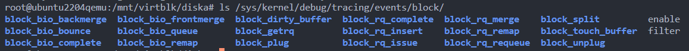

此外，为了能够方便实现对存储 IO 的全流程追踪，就要求我们的框架能够提供所有存储 IO 会涉及到的所有子模块的关键挂载点。我们目前的工作是在 Linux 内核中与存储 IO 相关的子模块中找了 45 个挂载点，涉及 fs 层，block 层和 driver 层（bio 和 request 相关），pagecache 层（page 相关），还有各个具体的设备驱动层级的挂载点包括 nvme、scsi、virtio 驱动的挂载点。


**选取挂载点，主要考虑：**
- 能否反映处理流程的重要时延信息
- 能否提供过滤器所需信息
- 能否尽量多地执行覆盖路径
下面是我们选取各个层级挂载点是考虑的思路：

#### a. syscall layer

这部分主要挂载在同步 IO 系统调用的入口/出口，在入口处，所有系统调用都提供读写目标文件的文件描述符，这是我们获取文件和设备过滤信息的重要数据，借助文件描述符以及当前的任务上下文 task_struct ，可以获取到代表实际文件的 struct file* 结构体，从而获取到目标文件的诸多信息，从而帮助实现过滤器中最重要的过滤起点——活动上下文的记录。

直接通过 eBPF 提供的挂载系统调用的结构 ksyscall 类 eBPF 程序可以很好获取系统调用的参数。

具体涉及的挂载点在 `src/include/hook_point.h` 中定义类型，前缀为 `syscall__*`，在 `src/iotrace.bpf.c` 中实现相应的 eBPF 程序. 具体语义在 [挂载点文档](./io_hookpoint.md) 中有详细描写。

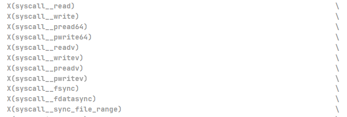

#### b. fs layer

 IO 系统调用陷入到内核态后，会根据文件描述符获取到相应的 file 结构体，然后根据文件偏移来初始化控制读写的数据结构。我们在 fs layer 选取挂载点的目的时为整个请求提供对文件逻辑地址空间的读写区间，为后续关联用户态事件（qemu 事件）提供数据依据。

如 `ssize_t do_iter_read(struct file *file, struct iov_iter *iter, loff_t *pos, rwf_t flags)`  这个挂载点，通过 pos 指针可以获得读写的文件偏移、通过 iov_iter 可以获取文件读写长度，从而该请求对文件的读写区间。

比如` iomap__dio_rw` 可以覆盖 direct IO 的路径， `fs__generic_file_read_iter` 表示准备从 pagecache 读数据等语义，可以覆盖较多代码路径。

涉及到挂载点的语义可在 [挂载点文档](./io_hookpoint.md) 中查看。


#### c. pagecache layer (page)

pagecache layer 的挂载点用于追踪 page 数据结构的处理流程，主要涉及IO请求对 pagecache 的 hit，dirty 行为，还有 struct page* 数据结构在 pagecache 中的加入和退出。

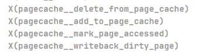

同时，`mark_page_accessed` 和 `writeback_dirty_page` 函数发生在同步 IO 的上下文中，所以可以用来把请求上下文和 **page 数据结构关联起来。**

其中对 page 的处理流程的关联通过 page 的指针作为 id，用来标识当前系统中的活动 page。

涉及到挂载点的语义可在 [挂载点文档](./io_hookpoint.md)  中查看。

#### d. block layer (bio,request)

block layer 的挂载点用于追踪 bio 和 request 数据结构的关系。

比如 block_bio_queue 标识 bio 开始进入 block layer，并且可以提供 bio 的 id，同时会发生在同步 IO 的上下文中。**所以用来把请求上下文和 bio 数据结构关联起来。**

**在这部分中出现了挂载点语义正确但是没有办法提供所需要数据的情况！**

我希望能够维护 bio 和 request 之间的活动关系，这就要求挂载点提供的参数中既能提供 bio 的 id 也要提供 request 的 id。

但是对于 tracepoint `block_rq_merge` 和 `block_rq_get` 都表示一个 bio 进入到了某个 request 中，只要能够获取到二者的 id，**即可通过 map 完成 bio 和 request 的关联。**

但是会发现 `block_rq_merge` 只提供参与 merge 的 bio 的信息，没有提供参与 merge 的 request 的信息，从而没办法获取 requets id。

**解决方法：找到可代替的同语义的内核函数或者 tracepoint**

通过阅读 Linux 源码岔开 tracepoint block_rq_merge 的出现位置，会发现有函数 `__rq_qos_merge`和 trace_block_rq_merge 总会出现在相同位置，**所以可以判断语义相同。**

查看函数的参数

`void __rq_qos_merge(struct rq_qos *rqos, struct request *rq, struct bio *bio);`

会发现提供了参与 merge 的 request 和 bio 的信息，所以我们的挂载点选取 `__rq_qos_merge` 而不是 `block_rq_merge`.

涉及到挂载点的语义可在 [挂载点文档](./io_hookpoint.md) 中查看。

#### e. nvme layer 、scsi layer、virtio layer

在 NVMe 和 SCSI驱动中，虽然都有着自己的命令的标准与规范，用 nvme_cmd ，scsi_cmd 来表示具体驱动规范的数据。但是实际上这些还是依赖于 request 数据结构而进行，所以称为 request base driver。

主要关注 request 在进入和退出 nvme 驱动，scsi 驱动，virtio 驱动时的事件。

特别是 virtio 驱动，在后续实现 qemu/kvm 中 virtio 全链路追踪其重要作用。

涉及到挂载点的语义可在 [挂载点文档](./io_hookpoint.md)中查看。

#### f. sched layer

通过对 tracepoint ：sched_swith 的追踪，结合过滤机制，其参数就是涉及任务切换的两个任务上下文，所以容易把事件和请求关联上。把涉及到当前活跃上下文的任务切换的事件抓取出来，用于分析 IO 请求的 oncpu 和 offcpu 时间占比。

涉及到挂载点的语义可在 [挂载点文档](./io_hookpoint.md) 中查看。

#### request 与 bio 关联时遇到的问题与解决

对于同步 IO 来说，syscall 和 fs 层的请求直接根据活动上下文关联、对于 pagecache 层，通过 page id 即 page 数据结构的地址来关联、对于 block ，各个 driver 层，则通过 bio 和 request 的 id 即地址来关联。

其中在实现 bio 和 request 的关联时， request 与 bio 的 1 对 多关系，所以需要维护以下的关系，活动 bio 与活动上下文的关系，以及一个 request 与多个 bio 的关系。

在内核态的 eBPF 程序中，不容易表示这类情况，因为当一个 request 出现某个事件时，需要为每一个 bio 都生成一个事件，这会导致内核与用户态之间的数据传输更多，增大开销，并且 eBPF 程序中执行遍历操作限制大。综上，还是选择在用户态维护 bio 和 request 间的关系，从而在一个 request 的事件到达时，可以为多个 bio 增添事件。

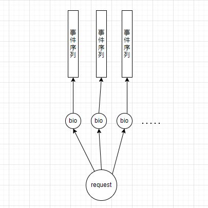

#### 用户态部分的事件关联

用户态在获取到内核事件时，就会获取每个事件的时间戳和事件类型，每个类型都有自己的数据。

在 src/include/event_defs.h 中有关于内核向用户态传输事件的结构体：使用匿名 union 来节省内存。

```cpp
struct event {
  long long timestamp;
  enum kernel_hook_type event_type;
  enum info_type info_type;
  enum trigger_type trigger_type;
  union {
    struct {
      int tid;
      enum rq_type rq_type;
      long long virt_rq_addr;
      long long offset;
      int nr_bytes;
      int prev_tid;
    } qemu_layer_info;

    struct {
      int tid;
      int tgid;
      union {
        struct {
          unsigned long dev;
          unsigned long long inode;
          unsigned long long dir_inode;
          int fd;
        };
        struct {
          int ret;
        };
      };
    } syscall_layer_info;

    struct {
      int tid;
      int tgid;
      unsigned long offset;
      unsigned long bytes;
    } fs_layer_info;

    struct {
      int prev_tid;
      int next_tid;
    } sched_layer_info;
    struct {
      unsigned int  bio_id;
      unsigned int rq_id;
      int tid;
      int tgid;
      unsigned long long approximate_filemap_start_offset;
      unsigned int approximate_filemap_len;
      unsigned long sector;
      unsigned int nr_bytes;
    } block_layer_info; // 对于 bio 的 split，queue，end 事件。

    struct {
      unsigned long long rq_id;
      unsigned int dev;
    } nvme_layer_info;

    struct {
      unsigned long long rq_id;
      unsigned int dev;
    } scsi_layer_info;

    struct {
      unsigned long long rq_id;
      unsigned int dev;
    } virtio_layer_info;
  };
};
```

用户态程序在处理每一个事件时，根据事件类型来选择处理逻辑。

在 `src/iotracer.cpp` 中有对每个事件的处理策略, 每个子模块都有自己的事件关联策略，具体可以到 `src/iotracer.cpp` 中查看。

其中，Syscall 和 Fs ，sched 层的事件通过 tid 来关联、Block 和 Scsi Nvme 和 Virtio 层根据 bio 和 request id 进行关联。

```cpp
void IOTracer::AddEvent(void *data, size_t data_size) {
  if (data_size != sizeof(struct event)) {
    return;
  }
  struct event *e = (struct event *)data;
  if (e->timestamp < setup_timestamp) {
    return;
  }
  // debug(NULL, data, data_size);
  switch (e->info_type) {
  case syscall_layer: {
    HandleSyscallEvent(e);
    break;
  }
  case fs_layer: {
    HandleFsEvent(e);
    break;
  }
  case block_layer: {
    HandleBlockEvent(e);
    break;
  }
  case sched_layer: {
    HandleSchedEvent(e);
    break;
  }
  case scsi_layer: {
    HandleScsiEvent(e);
    break;
  }
  case nvme_layer: {
    HandleNvmeEvent(e);
    break;
  }
  case virtio_layer: {
    HandleVirtioEvent(e);
    break;
  }
  case qemu_layer: {
    HandleQemuEvent(e);
    break;
  }
  }
}
```
### 2. （基础功能）过滤器的设计与实现

在第一点中，我们介绍了我们框架中的挂载点选取工作基于用户态程序会如何对框架中的挂载点的事件进行处理。在这之后，我们就需要实现自己的过滤器机制，然后将框架中的不关心的挂载点进行事件过滤，对关心的挂载点进行数据关联。

首先，这部分我们在初赛阶段做的并不好。
#### 初赛中存在的不足

初赛中，我们虽然借助这些挂载点完成了全链路追踪，但是因为过滤机制不够高效，导致性能问题突出。
<!-- 
初赛实现对 bio，request 数据结构的处理流程追踪时，我们借鉴了已有工具 blktrace 的设计思路。

目前 blktrace 工具是分析 linux 系统 IO 请求在 block layer 与 driver layer 的活动情况的强大工具，但是它只支持对整个块设备的 IO 请求的数据采集与关联。

但是我们需要依据对 bio、request 数据的追踪完成对更细维度的追踪比如线程、进程等，所以 blktrace 提供的功能比较粗粒度，没办法直接用 blktrace 完成我们的任务。但是了解 blktrace 内部实现后，会发现其中用到了的 tracepoint 可以提供很好参考。

> 在 Linux 内核源码中 `include/trace/events/block.h`  可以看到 bio 和 request 相关的 tracepoint，每个 tracepoint 都会生成一个包含了 bio 或者 request 表示的物理读写区间。结合 blktrace 的源码，可以发现 blktrace 内部维护了这些区间，从而在用户态还原了内核中 bio 和 request 请求的交互流程，从而对它们的处理流程进行统计分析，从而实现 blktrace 的功能。
>
> blktrace 在用户态维护了一个红黑树来维护这些区间的关系，即维护 request 和 bio 的 1 对 多关系，方便在某个 request 触发某个事件时，把事件扩散给多个 bio。

在初赛提交的代码中，我们尝试模仿 blktrace 的思路：利用 eBPF 从 block_bio_queue 等 tracepoint 获取数据，在用户态维护 request 和 bio 的 1 对 多关系，从而维护了 bio 和 request 数据结构在 block layer 与 driver layer 子模块的处理流程。详情可查看我们的初赛文档。[初赛文档](./初赛开发文档.md) -->

<!-- 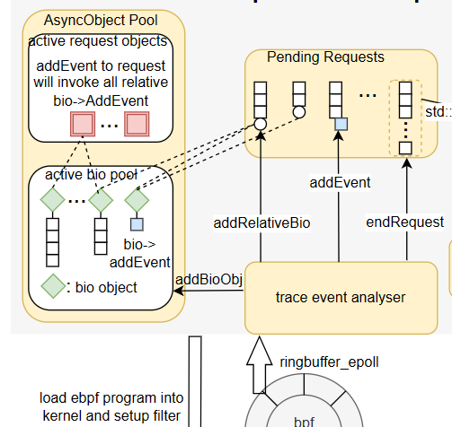 -->

**初赛之后复盘发现设计存在两个问题：**

1. 从内核发完用户态的事件数量太多了，并且用户态程序逻辑复杂，导致 eBPF 用户态程序基本处于满载状态，并且导致使用的 ringbuffer 存在内存不足，出现事件丢弃的情况。
2. eBPF 内核事件的开销过大，给系统整体负载带来很大开销。

初赛中，我们过于关注事件在不同子模块之间的关联反而忽略了过滤机制的重要性。在初赛中，仅仅是在挂载点中尝试获取与这些过滤条件直接有关的数据，比如线程的 tid、pid，IO请求的目标文件的磁盘设备号，若符合过滤条件符合则丢弃。

bcc 工具中大多数是这种过滤机制。对于少数的几个挂载点来说，这个简单的过滤已经足够了，但是如果触发次数比较频繁并且获取内核的数据过程比较麻烦。比如下面的 vfs_read 和 filemap_get_pages 两个 fs 层挂载点，会发现使用了非常多的 `BPF_CORE_READ` 来获取内核数据，用来进行过滤判断。但是实际上，对于同步 IO 来说，如果 vfs_read 能够知道本上下文确实正在处理 IO 请求，那么就可以通过只获取 tid 和 tgid 来完成过滤。

如下图，两个挂载点都用比较复杂的逻辑获取很多数据，但是实际上是非必要的。

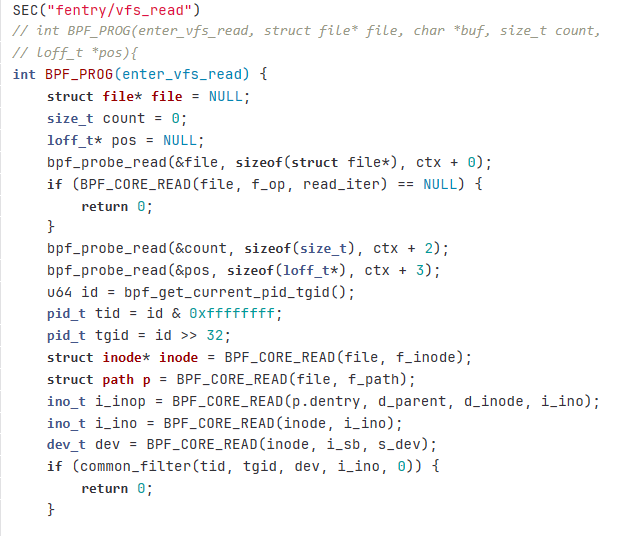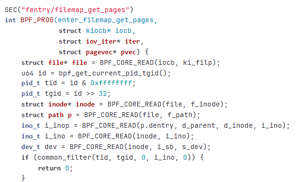

#### 复赛重新设计过滤机制

**在复赛中，我们重新审视了过滤机制在 eBPF 程序中的重要性**：

- eBPF 的优势在于可编程的获取内核数据以及可以实现较复杂的处理逻辑，同时还有丰富的 eBPF Maps 数据结构辅助编程。
- 单纯的事件传输方面，eBPF 本身不存在太多优势

所以我们希望要实现低开销，则必须利用 eBPF 的优势设计一个过滤机制，它存在以下功能：

- 以较小的开销根据给定过滤条件过滤与目标请求执行流程无关的事件。
- 在过滤事件的同时，把事件初步关联起来，即在事件中带上与事件关联的信息。

**解决方案**

我们有如下过滤机制：（注：同步与异步是相对与用户发起请求的上下文来说的）
- 一、对用户上下文同步事件的过滤
- 二、对 page,bio,request 等内核上下文处理的异步数据结构的过滤


一、同步事件的过滤指：在某上下文发起同步 IO 系统调用时，获取过滤器判断所需数据，若未被过滤器丢弃，则记录该上下文为活动上下文。后续的同步事件通过判断本上下文是否为活动上下文即可完成过滤。在具体实现中，把活动上下文的 tid 记录在 **eBPF Hash Map** 中，在该请求结束时删除该记录。

通过活动上下文，容易过滤掉不属于我们关心的 IO 请求的同步事件。

二、对 page，bio，request 等异步数据结构的过滤是指：我们不希望捕获系统范围内的所有 page，bio，request，而是通过活动上下文与这些数据结构之间的关联判断哪些是活动。在具有维护 page，bio，request 数据结构生命周期的 eBPF 挂载点上，维护它们与活动上下文的关系，把活动数据结构的 id 记录在 eBPF Hash Map 中，并且在活动数据结构在内核上下文的处理流程中，根据触发的 eBPF 挂载点的语义维护 eBPF Hash Map 的增删改查。 

**设计思路**：

对于发起同步 IO的上下文来说（包括，read/write 、pread/write、fsync/fdatasync 等），导致请求时延抖动的情况往往是本请求发现 pagecache miss 以及 dirty 而主动从块设备读入以及等待脏页写回块设备，这种情况下导致请求时延波动的 bio 请求就是由本上下文发起的。 而对于 epoll，io_uring，AIO 等使用了比较复杂的机制，其在现代软件提高 IO 性能中有着重要意义，但是因为机制与普通的读写差异较大，要求我们对这些机制由更深入的了解才能很好的设计追踪与过滤机制，本项目目前不涉及。通过分析 block_bio_queue 的语义 ，发现它实际上是由与发起同步 IO 的上下文触发的。

具体的实现上，block_bio_queue 是用户上下文发起 bio 的挂载点，该事件触发时，根据当前上下文的线程号来判断是否有活动上下文触发。若是，则把该 bio 的 id 存入到 eBPF Map 中，之后在 bio 相关的事件中，可根据 eBPF Map 中是否存有 bio 的 id 来判断是否为活动 bio。

并且，由于 bio 是 request 的组成部分。所以与活动 bio 有关联的 request 就是 活动 request。系统中的内核函数 \_\_rq_qos_track(struct bio\*, struct request\*) 触发时说明 bio 加入了 reqeust，如果此时 bio 本身是活跃的，那么该 reqeust 也是活跃的 。

具体实现上用了很多用于管理 bio 和 request 之间联系的挂载点，均在 block layer（详情见挂载点文档 doc/io_hookpoint.md）。

非活跃 bio 和 request 触发的 block layer 事件不会被传输到用户态，实现了过滤功能，可以很好减少事件处理与传输带来的开销。 

下面是描述 bio 和 request 之间的交互、生命周期的挂载点：

- 在 block_bio_queue 中，我们通过判断当前是否处于活动上下文来选择是否把该 bio 记录为活动 bio
- 在 rq_qos_track 中，通过判断 bio 是否为活动 bio 来选择是否把事件传输给用户态，以及选择是否把 request 标记为活动。
- 在 rq_qos_bio_done 和 rq_qos_done 分别是标志 bio 和 requets 的生命周期结束，会把活动 bio 或 request 变为非活动。

```cpp
SEC("tp_btf/block_bio_queue") // 开始追踪一个 bio
int handle_tp7(struct bpf_raw_tracepoint_args *ctx)
{
  if(!block_enable){
    return 0;
  }
  // 先判断当前线程是否被过滤
  pid_t tgid, tid;
  if (get_and_filter_pid(&tgid, &tid)) {
    return 0;
  }
	// 判断当前线程是否是活动的上下文
  int* tid_in_syscall = bpf_map_lookup_elem(&tid_syscall_enter_map, &tid);
  if(tid_in_syscall == NULL){
    return 0;
  }
    // 把当前的 bio 加入到活动 bio_ref_map 中
	struct bio *bio = (struct bio *)(ctx->args[0]);
	struct bio_vec *first_bv = bio->bi_io_vec;
	struct page *first_page = first_bv->bv_page;
  // add to bio_ref_map
  long long bio_id = 0;
  int *bio_ref = bpf_map_lookup_elem(&bio_ref_map, &bio);
  if (bio_ref == NULL) {
    bpf_map_update_elem(&bio_ref_map, &bio, &bio_id, BPF_ANY);
  } else {
    bio_id = *bio_ref;
  }
	return 0;
}

SEC("fentry/__rq_qos_track") // 追踪 bio 和 request 间的关联
int BPF_PROG(trace_rq_qos_track, struct rq_qos *q, struct request *rq, struct bio *bio)
{
  if(!block_enable){
    return 0;
  }
    // 判断 bio 是否是活跃的
  long long rq_id, bio_id;
  int *bio_ref = bpf_map_lookup_elem(&bio_ref_map, &bio);
  if (bio_ref == NULL) {
    return 0;
  } 
  bio_id = *bio_ref;
  
    // 若 bio 是活跃的，则 request 也是活跃的，加入 request_ref_map 中记录下来
  int *request_ref = bpf_map_lookup_elem(&request_ref_map, &rq);
  if (request_ref == NULL) {
    rq_id = __sync_fetch_and_add(&global_rq_id, 1); 
    bpf_map_update_elem(&request_ref_map, &rq, &rq_id, BPF_ANY);
  } else {
    rq_id = *request_ref;
    bpf_debug("rq_qos_track:request %lx already in request_ref_map\n",rq);
  }
	return 0;
}

SEC("fentry/__rq_qos_done_bio") // 代替 block_bio_complete, 用来删除活动 bio 的记录
int BPF_PROG(trace_rq_qos_done_bio, struct rq_qos *q, struct bio *bio)
{
  if(!block_enable){
    return 0;
  }
  // 如果 bio 在 bio_ref_map 删除记录
  long long bio_id;
  int *bio_ref = bpf_map_lookup_elem(&bio_ref_map, &bio);
  if (bio_ref == NULL) {
    return 0;
  } else {
    bio_id = *bio_ref;
    bpf_map_delete_elem(&bio_ref_map, &bio);
	  bpf_debug("rq_qos_done_bio target bio: %lx\n", bio);
  }

	return 0;
}

SEC("fentry/__rq_qos_done") // 用来代替 block_rq_complete, 用来删除活动 request 的记录
int BPF_PROG(trace_rq_qos_done, struct rq_qos *q, struct request *rq)
{
  if(!block_enable){
    return 0;
  }
  // request 在 request_ref_map 中，删除记录
  int *request_ref = bpf_map_lookup_elem(&request_ref_map, &rq);
  if (request_ref == NULL) {
    return 0;
  } else {
    bpf_map_delete_elem(&request_ref_map, &rq);
    bpf_debug("rq_qos_done\n" );
  }
	return 0;
}
```

#### 基于上述过滤机制的过滤器具体实现

有上述对依据活动上下文和活动数据结构的的过滤机制后，可以实现各种条件下的过滤器。

思路：在系统调用的入口处，获取与过滤条件相关的数据，然后进行过滤，若不被过滤，则把当前线程加入到活动上下文的记录中。

下面时过滤的具体实现：

- 对于线程和进程级别的过滤机制，只需要判断发起同步 IO 的上下文的进程/线程号是否属于该线程/进程。
  - eBPF 中存在 bpf_get_current_pid_tgid 辅助函数
- 对于 cgroup 的过滤，只需要判断发出同步 IO 的上下文所运行的 cgroup id 即可判断。
  - eBPF 中存在 bpf_get_current_cgroup_id 辅助函数
- 对于磁盘、文件、目录维度的过滤，只需要判断发出同步 IO 时的文件描述符结合请求上下文即可通过 eBPF 获取该请求的目标文件的属性以及所属设备号，判断该属性即可判断是否属于目标磁盘设备的 IO 请求。
  - 需要我们依靠 struct task_struct 结构体依据文件描述符查看在该上下文实际上在读写的文件
  - 通过文件结构体 struct file* 可以获取文件所在磁盘设备号、inode 号以及目录的 inode 号

以下为实现上述功能的 eBPF 程序，具体功能的展示和验证，可以看 [功能测试文档](functional-test.md)。

```cpp
static int inline get_and_filter_pid(pid_t *tgid, pid_t *tid) {
  u64 id = bpf_get_current_pid_tgid();
  *tgid = id >> 32;
  *tid = id & 0xffffffff;
  return pid_filter(*tgid, *tid);
}

static int inline get_and_filter_cgid(long long *cgid) {
  *cgid = bpf_get_current_cgroup_id();
  if(filter_config.cgroup_id != -1 && filter_config.cgroup_id != *cgid){
    return 1;
  }
  return 0;
}

static int inline update_fd_inode_map_and_filter_dev_inode_dir(int fd, ino_t *inodep,
                                                        dev_t *devp,
                                                        ino_t *dir_inodep) {
  int ret = 0;
  ino_t inode = 0;
  dev_t dev = 0;
  ino_t dir_inode = 0;
  struct task_struct *task = bpf_get_current_task_btf();
  struct files_struct *files = task->files;
  struct fdtable *fdt;
  struct file **fdd;
  struct file *file;
  fdt = files->fdt;
  fdd = fdt->fd;
  bpf_core_read(&file, sizeof(struct file *), fdd + fd);
  struct inode *iinode = BPF_CORE_READ(file, f_inode);
  // filter and update filterd fd map
  ret = filter_inode_dev_dir(iinode, file, &inode, &dev, &dir_inode);

  if(ret){
    return 1;
  }
  if (inodep != NULL)
    *inodep = inode;
  if (devp != NULL)
    *devp = dev;
  if (dir_inodep != NULL)
    *dir_inodep = dir_inode;
  return 0;
}
```

在使用 eBPF 实现了过滤器功能之后，用户在运行 zero-tracer 时，就可以根据自己希望追踪的 IO 请求的特征来设置过滤条件，减少不必要事件带来的开销。

**过滤器支持的过滤条件**

- 提供目标进程的进程号或者线程的线程号（需要用户自行使用 ps 命令获取目标的 pid 或 tid）
- 提供目标任务运行所在的 cgroup 根目录的路径 
- 提供目标 IO 请求读写的文件路径，或者所在目录的路径
- 提供目标磁盘设备在 /dev 下的路径

我们在内核中的过滤依据为 pid 和 tid 还有就是 cgroup_id, 文件或者目录的 inode number，块设备的设备号。

所以我们对用户的输入进行转换（位于 src/utils.cpp)，分别把**用户指定的路径转换成对于的 cgroup_id, inode 号，设备号。**。转换的具体代码逻辑如下：

```cpp
unsigned long long get_cgroup_id(const char *path) {
  int dirfd, err, flags, mount_id, fhsize;
  union {
    unsigned long long cgid;
    unsigned char raw_bytes[8];
  } id;
  struct file_handle *fhp, *fhp2;
  unsigned long long ret = 0;
  dirfd = AT_FDCWD;
  flags = 0;
  fhsize = sizeof(*fhp);
  fhp = (struct file_handle *)calloc(1, fhsize);
  if (!fhp) {
    return 0;
  }
  err = name_to_handle_at(dirfd, path, fhp, &mount_id, flags);
  if (err >= 0 || fhp->handle_bytes != 8) {
    goto free_mem;
  }
  fhsize = sizeof(struct file_handle) + fhp->handle_bytes;
  fhp2 = (struct file_handle *)realloc(fhp, fhsize);
  if (!fhp2) {
    goto free_mem;
  }
  err = name_to_handle_at(dirfd, path, fhp2, &mount_id, flags);
  fhp = fhp2;
  if (err < 0) {
    goto free_mem;
  }
  memcpy(id.raw_bytes, fhp->f_handle, 8);
  ret = id.cgid;
free_mem:
  free(fhp);
  return ret;
}

unsigned long long get_file_inode(const char* path){
  printf("file path: %s\n", path);
  struct stat buf;
  if (stat(path, &buf) < 0) {
    return 0;
  }
  return buf.st_ino;
}

unsigned long long get_device_id(const char* path){
  printf("device path: %s\n", path);
  struct stat buf;
  if (stat(path, &buf) < 0) {
    return 0;
  }
  return buf.st_rdev;
}
```


### 3. (基础功能) 对追踪结果的处理

#### 统计功能

我们可以在获取到一个完整的请求 trace 之后，就拥有了各个事件的类型与时间戳。从而可以对这个请求的各个阶段进行统计分析，比如

- q2c，d2c，q2d 的时延统计
  - q2c 表示一个 bio 请求从 queue 到 complete 的时间。
  - d2c 表示一个 bio 请求从发向硬件队列到 complete的时间。
  - q2d 表示一个 bio 请求从 queue 到被 IO 调度器选中发向硬件队列的时间。
- offcpu 的时间统计
  - 表示，一个系统调用中由内核上下文执行的时间和占比。
- 整体的时延统计
  - 请求的时延统计

进行统计的函数如下：
通过遍历已完成关联的事件信息，我们可以容易得到各种事件间的关联。

比如 sched_switch 的换出与换入之间就是线程 offcpu 的时间。 block_bio_queue 到 block_rq_issue 就是 q2d 时间，block_rq_issue 到 block_rq_complete 就是 q2c 时间。

```cpp
void analyseRequest() {
    auto req = this;
    
    long long offcpu_time = 0, switchout_start;
    long long avg_time_getpage = 0, getpage_start = 0, getpage_count = 0;
    long long q2c_time = 0;
    long long q2d_time = 0;
    long long d2c_time = 0;

    for (int i = 0; i < req->events.size(); i++) {
      if (req->events[i]->event_type ==
          kernel_hook_type::fs__filemap_get_pages) {
        if (req->events[i]->trigger_type == trigger_type::EXIT) {
          avg_time_getpage += req->events[i]->timestamp - getpage_start;
        } else if (req->events[i]->trigger_type == trigger_type::ENTRY) {
          getpage_start = req->events[i]->timestamp;
        }
      } else if (req->events[i]->event_type ==
                 kernel_hook_type::pagecache__mark_page_accessed) {
        getpage_count++;
      } else if (req->events[i]->event_type ==
                 kernel_hook_type::sched__switch) {
        if (req->events[i]->trigger_type == trigger_type::ENTRY) {
          switchout_start = req->events[i]->timestamp;
        } else if (req->events[i]->trigger_type == trigger_type::EXIT) {
          offcpu_time += req->events[i]->timestamp - switchout_start;
        }
      }
    }

    for (int i = 0; i < req->io_statistics.size(); i++) {
      long long time1 = req->io_statistics[i].bio_done_time -
                        req->io_statistics[i].bio_queue_time;
      q2c_time += time1;
      if (req->io_statistics[i].bio_schedule_end_time != 0) {
        q2d_time += req->io_statistics[i].bio_schedule_end_time -
                    req->io_statistics[i].bio_queue_time;
        d2c_time += req->io_statistics[i].bio_done_time -
                    req->io_statistics[i].bio_schedule_end_time;
      }
      req->bio_cnt += 1;
    }

    req->avg_d2c += d2c_time;
    req->avg_q2c += q2c_time;
    req->avg_q2d += q2d_time;
    req->avg_readpage += avg_time_getpage;
    req->avg_offcpu += offcpu_time;
    req->avg_time += req->end_time - req->start_time;
    req->done_count += 1;
    return;
  }
```

#### 前端日志展示

我们在设计的时候，考虑到可能会把我们抓取到的 trace 信息进行不同的通知。比如上传到 grafana 进行更美观的前端展示，还有打印日志到某一文件，亦或者把整个请求发送到 host OS，让 host 端 zero-tracer 进一步处理，所以采用专门的接口来适配不同情况。

在代码实现中，我们通过继承 一个简单的基类来表示接口。

```cpp
class DoneRequestHandler {
public:
  explicit DoneRequestHandler() {}
  virtual ~DoneRequestHandler() {}
  virtual void HandleDoneRequest(std::shared_ptr<Request>, TraceConfig &) = 0;
};
```

我们目前实现了两个适配接口。

一个是把日志简单打印到文件里，在[功能测试文档](./functional-test.md)查看

```cpp

void FileLogHandler::HandleDoneRequest(std::shared_ptr<Request> req,
                                       TraceConfig &config) {
  unsigned long long total_time = req->end_time - req->start_time;
  double ms = timestamp2ms(total_time);
  unsigned long long base_time = req->start_time;
  // time
  fprintf(file, "rq%lld  cost %.5lfms (tid pid) %d %d\t""ino %ld dir ino %ld dev 0x%lx\n", req->id, ms,
          req->syscall_tid, req->syscall_pid, req->syscall_inode,
          req->syscall_dir_inode, req->syscall_dev);
  fprintf(file,"avg : time - %.5lfms q2c - %.5lfms q2d - %.5lfms d2c - %.5lfms\n", ms,
          timestamp2ms(req->avg_q2c) / req->bio_cnt,
          timestamp2ms(req->avg_q2d) / req->bio_cnt,
          timestamp2ms(req->avg_d2c) / req->bio_cnt);
  fprintf(file, "avg : avg_readpage - %.5lfms avg_offcpu - %.5lfms avg_offcpu_ratio - %.5lf\n",
          timestamp2ms(req->avg_readpage) / req->done_count,
          timestamp2ms(req->avg_offcpu) / req->done_count,
         (double)req->avg_offcpu / req->avg_time);
  std::string indent = "";
  for (int i = 0; i < req->events.size(); i++) {
    double ems = timestamp2ms(req->events[i]->timestamp - base_time);
    const char *event_type = kernel_hook_type_str[req->events[i]->event_type];
    if (req->events[i]->trigger_type == trigger_type::ENTRY) {
      fprintf(file, "[%.5f]%s %s{\n", ems, indent.c_str(), event_type);
      indent += "  ";
    } else if (req->events[i]->trigger_type == trigger_type::EXIT) {
      indent = indent.substr(0, indent.size() - 2);
      fprintf(file, "[%.5f]%s } %s\n", ems, indent.c_str(), event_type);
    } else {
      fprintf(file, "[%.5f]%s %s\n", ems, indent.c_str(), event_type);
    }
  }
}
```

还有一个是结合 opentelemety 进行把消息发送到 grafana ，实现远程 web 展示。其中涉及到把我们生成的 trace 数据结构转换成 opentelemetry 的格式，然后通过发送到 grafana 进行展示。

```cpp
void GrafanaClientLogHandler::HandleDoneRequest(std::shared_ptr<Request> req,
                                                TraceConfig &config)
{

  // assign req value to request
  ProtoRequest request;
  std::cout << "emit request"
            << "\n";
  request.set_proto_request_duration(req->end_time - req->start_time);
  unsigned long long base_time = req->start_time;

  for (int i = 0; i < req->events.size(); i++)
  {
    ProtoEvent event;
    double ems = timestamp2ms(req->events[i]->timestamp - base_time);
    event.set_proto_event_duration(ems);
    event.set_proto_event_id(req->events[i]->timestamp); // time stamp is unique

    const char *event_type = kernel_hook_type_str[req->events[i]->event_type];
    if (req->events[i]->trigger_type == trigger_type::ENTRY)
    {
      event.set_proto_trigger_type(ProtoTriggerType::proto_trigger_entry);
    }
    else if (req->events[i]->trigger_type == trigger_type::EXIT)
    {
      event.set_proto_trigger_type(ProtoTriggerType::proto_trigger_exit);
    }
    else
    {
      event.set_proto_trigger_type(ProtoTriggerType::proto_trigger_normal);
    }

    request.add_proto_events()->CopyFrom(event);
  }

  std::string serialized_request;
  request.SerializeToString(&serialized_request);

  ssize_t bytes_sent = sendto(sockfd, serialized_request.c_str(), serialized_request.length(), 0, (struct sockaddr *)&server_addr, sizeof(server_addr));

  if (bytes_sent < 0)
  {
    perror("Error sending data");
  }
}
```
接入grafana 的效果为：


### 4. (性能目标)对项目性能的评估和优化方案

**详细性能报告文档在** [性能测试文档](./performance-test)

在初赛中，我们实现了一个能够完成全链路追踪，但是性能非常糟糕的 tracing 工具，没有办法称为 zero-tracer。

#### 内核态过滤器的优化

初赛中，我们没有花精力设计过滤机制使得用户态和内核态之间数据传输量过大，并且把大部分事件关联的工作放到用户态，导致性能开销大的同时，容易出现事件丢失的情况。

在复赛中，我们总结里性能出现问题的原因，然后做了很多性能方面的优化与思考。

上面已经提到了过滤器的设计实现，其中大大减少了无用事件的处理与传输，这个东西一出来，就把我们的性能从初赛的 20% 每核降低到 5%以内，特别是用户态从 ringbuffer 获取数据时的 CPU 占用从 80%到20%，实现了巨大优化。

下面，介绍我们在性能优化方面的工作和对瓶颈的考量。

#### 内核态 eBPF 程序的优化

内核态的 eBPF 程序的工作就是为每一个挂载点获取内核数据，从而帮助过滤和获取帮助事件关联的信息。

1. ringbuffer 的使用。ringbuffer 是内核 5.8 版本开始支持的高效的用户空间和内核空间之间数据传输的环形缓冲区。它被用来取代 perf buffer 从而提高 tracing 事件的传输效率。 它支持单核独占的模式也支持全局共享模式。我们项目要求在 5.15 内核版本进行，所以可以使用 ringbuffer 来提高性能。

   我们在考虑是否需要用 per cpu 的 ringbuffer 进行事件传输，但是考虑到我们进行 tracing 需要保证事件的时间戳顺序，而全局的 ringbuffer 可以自然地维护时间戳有序，从而不需要额外的工作来保证这点。在没办法确保使用 per cpu 带来的编码和可能的额外开销是否值得时，我们还是选择使用全局共享的 ringbuffer 来传输数据。

   [[v4,bpf-next,4/5\] bpf: add BPF ringbuf and perf buffer benchmarks - Patchwork (ozlabs.org)](https://patchwork.ozlabs.org/project/netdev/patch/20200529075424.3139988-5-andriin@fb.com/)

2. eBPF 程序的类型

   事实上，eBPF 在 tracing 方面的应用已经很长事件，开发者们对 tracing 方面的支持也越来越多。其中，提出了 eBPF tracing 类型的程序，称为 fentry/fexit/tp_btf，它们相比传统的 kprobe/kretprobe/raw_tracepoint 具有更低的开销。其中我们用  fentry/fexit 取代 kprobe/kretprobe 用 tp_btf 来 取代 raw_tracepoint。一个重要原因是因为前者都很好地支持了 btf，导致我们读取内核数据时，不需要通过 bpf_probe_read_str() 辅助函数来读取，而是直接以 c 风格的指针引用来获取数据。这会使得编译出来的 eBPF 字节码更少，同时不需要调用外部函数，显然实现同样的功能，使用更新的 eBPF tracing 类型的程序是个很好的选择。[Re: Questions on BPF_PROG_TYPE_TRACING & fentry/fexit — BPF (spinics.net)](https://www.spinics.net/lists/bpf/msg58436.html)

#### 用户态程序的优化

我们的用户态使用的 C++ 语言编写，主要任务就是读取用户对过滤器的配置，加载 eBPF 程序，然后就是负责从 ringbuffer 中获取来自内核的事件并进行最后的事件关联，把事件组成完整的请求路径信息，并且把完整的信息通过预设好的处理函数，输出成日志或者通过 http 请求发送给 grafana 展示。

注意到，用户态程序如果从 ringbuffer 的消耗速度跟不上内核空间的事件产生速度，就会出现事件丢失，从而导致请求的全链路信息不完整。

所以对用户态程序的优化主要是让用户态处理 ringbuffer 回传的事件的速度越快越好。

从而我们有两个优化：

1. **利用 FIFO 队列解耦对完整事件的处理，使用单独的处理线程来从 FIFO 队列中获取已完成的事件**。进而进行日志输出或者其它统计和分析工作，包括 http 请求这种比较耗时的任务。来让负责从内核获取与关联事件的线程能够专注于处理事件的工作。

   使用信号量来通知事件的到来(src/include/iotracer.h)

   判断该请求是否超时，如果超时就放入 FIFO 队列即可。

   ```cpp
    unsigned long long total_time = req->end_time - req->start_time;
         double ms = total_time / 1000000.0;
         
         req->analyseRequest();
   
         if (ms > config.time_threshold) {
           std::lock_guard<std::mutex> lock(request_to_log_queue.mutex);
           request_to_log_queue.results.push(req);
           sem_post(&request_to_log_queue.sem);
           return;
         }
   ```

   

2. **利用内存池加速小数据的申请与释放。我们会为每个内核事件申请一个或多个 Event 类，这个 Event 类是只有 4 个字段的小数据结构。**每个请求在处理完成之后，就会释放掉其拥有的 Event，所以这会导致频繁的 new 和 delete 带来的开销，并且 C++ 标准内置有内存管理机制，但是我们仍然重载 Event 类 的 new 和 delete 函数，使用一个轻量级的自动扩容的内存池作为加速缓存。经过测试，可以让我们的用户态程序的 CPU占用少 10% 左右。

```cpp
class Event {
public:
  // 重载 new 运算符
  void *operator new(std::size_t size) {
    if (size != sizeof(Event)) {
      throw std::bad_alloc();
    }
    // 从内存池中获取内存块
    void *ptr = nullptr;
    while (ptr == nullptr) {
      ptr = memory_pool_.allocate();
      if (ptr == nullptr) {
        std::cout << "memory pool is empty, waiting..." << std::endl;
      }
    }
    return ptr;
  }

  // 重载 delete 运算符
  void operator delete(void *ptr) noexcept {
    memory_pool_.deallocate(ptr);
  }
  class MemoryPool {
  public:
    MemoryPool() {
      // 分配内存池
      pool_ = static_cast<char *>(std::malloc(kPoolSize * sizeof(Event)));
      if (pool_ == nullptr) {
        throw std::bad_alloc();
      }
      // 初始化内存池
      for (std::size_t i = 0; i < kPoolSize; i += sizeof(Event)) {
        free_list_.push_back(pool_ + i);
      }
    }
    ~MemoryPool() {
      // 释放内存池
      std::free(pool_);
    }
    // 从内存池中获取内存块
    void *allocate() {
      std::lock_guard<std::mutex> lock(mutex_);
      void *ptr = nullptr;
      if (!free_list_.empty()) {
        ptr = free_list_.front();
        free_list_.pop_front();
      } else {
        // 当前内存池已经耗尽，从备用内存池中申请一块内存
        std::lock_guard<std::mutex> lock2(mutex2_);
        if (!backup_free_list_.empty()) {
          ptr = backup_free_list_.front();
          backup_free_list_.pop_front();
          // 将备用内存池中的内存加入到当前内存池中
          free_list_.push_back(ptr);
        } else {
          // 备用内存池也已经耗尽，申请一块新的内存
          expand_pool();
          ptr = free_list_.front();
          free_list_.pop_front();
        }
      }
      return ptr;
    }
    // 将内存块返回给内存池
    void deallocate(void *ptr) noexcept {
      // printf("deallocate\n");
      std::lock_guard<std::mutex> lock(mutex_);
      free_list_.push_front(ptr);
    }

  private:
    // 内存池的大小
    static constexpr std::size_t kPoolSize = (1 << 14);
    // 内存池
    char *pool_;
    // 空闲内存块列表
    std::mutex mutex_;
    std::list<void *> free_list_;
    // 备用内存池
    std::mutex mutex2_;
    std::list<void *> backup_free_list_;
    // 动态扩展内存池
    void expand_pool() {
        /*。。。。*/
    }
  };
  // 内存池
  static MemoryPool memory_pool_;
};
```

### 5.QEMU内部与外部通信的框架开发

#### a.通信方式选择

对于下一部分即将论述的virtio的追踪,要先解决guest和host的通信问题,因为最后需要把guest产生的tracing信息往host发送.
经过调研,通信方法主要有三种:TCP/IP,FIFO和vsock,它们的优缺点分别如下
* TCP/IP显然最通用最便捷,但是消息传递要经过整个网络栈,速度很慢,安全性也有一定问题(谁都可以建立连接)
* FIFO安全迅速,但是通信是单向的(这会导致时钟同步等需求不能满足),不能用于嵌套虚拟化环境(我们的测试环境就是嵌套虚拟化的)
* vsock速度只比FIFO慢一点,而且和TCP/IP一样易用,也可以保证安全性,支持嵌套虚拟化,就选它了

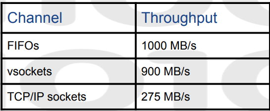

#### b.数据的(反)序列化
为了能把数据在guest和host之间传输,肯定要进行序列化.在序列化框架的选择上,我们选择了最轻量级的cereal
其他序列化框架(诸如boost)都很庞大臃肿,为了一个序列化功能,要安装庞大的库
而cereal只需要引入一些头文件,没有依赖,不需要冗长的make步骤,并且只需要在每个需要序列化的类里面添加一个小小的`serialize`函数

以下是几种序列化库的一个对比
* 左图是二进制数据流体积,左数第四个是cereal,发现其空间表现并不差
* 右图是序列化用时,左数第三个是cereal,发现其时间表现处在较先进的水平

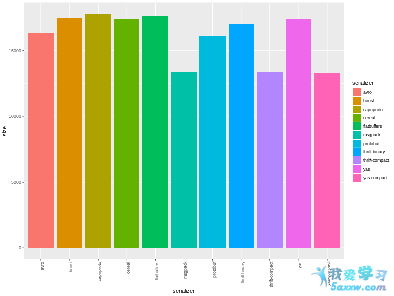
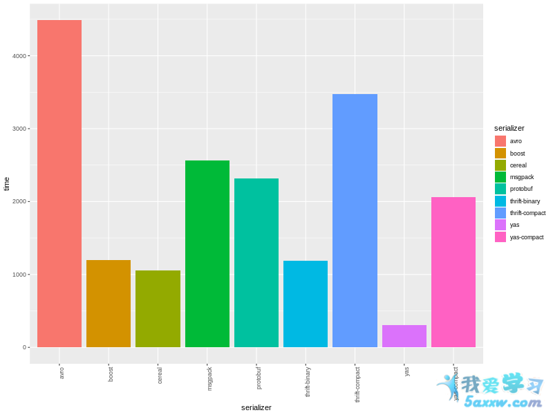

由此,我们可以选择cereal库进行序列化.值得一提的是cereal不支持裸指针,只支持`shared_ptr`和`unique_ptr`,这

我们为每个需要传输的类生成两个helper函数(在[这里](../src/mesgtype.cpp)),用于序列化和反序列化.这用宏定义实现,因为即便是模板也不能满足我们的要求

```c++
#define HELPER_MAKER(TYPE)                                      \
int send_helper_ ## TYPE(void * obj,char *& str)                \
{                                                               \
    TYPE * temp = (TYPE *)obj;                                  \
    std::ostringstream outs0;                                   \
    cereal::BinaryOutputArchive archive(outs0);                 \
    archive(*temp);                                             \
    return genstr(outs0,str);                                   \
}                                                               \
int recv_helper_ ## TYPE(void *& obj,char * str,int len)        \
{                                                               \
    TYPE * temp = new TYPE;                                     \
    std::istringstream ins0(std::string(str,len));              \
    cereal::BinaryInputArchive archive(ins0);                   \
    archive(*temp);                                             \
    obj = (void *)temp;                                         \
    return 1;                                                   \
}
```

可以看到,send_helper系列函数负责序列化,利用cereal将一个类转换为特定形式的二进制流存储在ostringstream对象中,最后把其中字符串中内容存储在传统的c_str内部用于发送

recv_helper负责反序列化,把发来的字符串转回对象.也是借助cereal和istringstream对象,这里注意,必须指定字符串的长度,否则因为二进制字节流内部是含有'\0'的,可能会导致字符串生成的不完全.

#### c.字节流的发送与接收

vsock的接口和TCP/IP的接口是一样的,都是使用socket编程.使用send/recv的时候,需要指定收发的长度,这个长度是灵活变动的,如何处理?有两种方法
* 方法一是预留足够大的缓冲区,保证能存的下任何大小的字节流.这样每次发送只需要一次send/recv,但是会造成额外的复制(要从统一预留的大缓冲区复制到消息私有的空间)
* 方法二是先发送一个首部(8字节),包括发送的类的类型和消息长度.然后在发送消息本体.这样不会有额外的复制,但是需要两次send/recv

为了扬长避短,我们设置一个阈值`SMALL_MESG_LIMIT_BYTES`(在[这里](../src/include/mesgtype.h)),消息长度不大于这个值就用方法一,大于这个值就用方法二.以下代码可以看出具体逻辑


```c++
int VSockEngine::sendstr(char * str,enum Type type,int len)
{
    int header[2 + SMALL_MESG_LIMIT_BYTES / 4];
    header[0] = type;
    header[1] = len;

    size_t len1 = sizeof(header);
    if(len <= SMALL_MESG_LIMIT_BYTES)
    {
        memcpy(header + 2,str,len);
    }

    int ret= write(sock_client, (void *)header, len1);
    if(ret != len1)
    {
        fprintf(stderr,"write header error\n");
        abort();
    }
    
    if(len > SMALL_MESG_LIMIT_BYTES)
    {
        ret = write(sock_client, (void *)str, len);
        if(ret != len)
        {
            fprintf(stderr,"write error\n");
            abort();
        }
    }
    return ret;
}

int VSockEngine::recvstr(char *& str,enum Type & type,int & len)
{
    int header[2 + SMALL_MESG_LIMIT_BYTES / 4];
    size_t len1 = sizeof(header);
    int ret = recv(sock_client, (void *)header, len1, 0); 
    if(ret != len1)
    {
        fprintf(stderr,"read header error\n");
    }

    type = (enum Type)header[0];
    len = header[1];
    str = new char[len];
    if(len <= SMALL_MESG_LIMIT_BYTES)
    {
       memcpy(str,header + 2,len);
    }
    
    else
    {
        ret = recv(sock_client, (void *)str, len, 0); 
        if(ret != len)
        {
            fprintf(stderr,"read error\n");
        }
    }
    return ret; 
}
```

#### d.用户接口设计

我们的`ClientEngine`类和`ServerEngine`类很相似,所以可以继承于基类`VSockEngine`

首先是构造/析构
构造时要创建套接字,建立链接,注册helper函数(这个都是在[宏定义](../src/include/mesgtype.h)部分手写的)
先进行client和server相同的步骤
```c++
VSockEngine::VSockEngine() {
  initStreamSock();
  getBeastAncestorAddr();
  registerHelpers();
}

ClientEngine::ClientEngine() : VSockEngine() {
  connAddr();
  sock_client = mysock;
}

ServerEngine::ServerEngine() : VSockEngine() {
  bindAddr();
  listenSock();
  acceptConn();
}
```

析构无非是释放链接
```c++
ClientEngine::~ClientEngine()
{
    close(mysock);
}

ServerEngine::~ServerEngine()
{
    close(mysock);
    close(sock_client);
} 
```

然后是当然是消息收发接口,调用了收发字符串的私有方法和helper
```c++
int VSockEngine::sendMesg(enum Type type,void * obj)
{
    char * buf;
    int actural_len = send_helper[type](obj,buf); //生成字符串,因为类里面可能有指针,导致直接强转会出问题
    int sent_len = sendstr(buf,type,actural_len);
    return sent_len;
}

int VSockEngine::recvMesg(enum Type & type,void *& obj)
{
    char * buf;
    int len;
    recvstr(buf,type,len);
    //std::cout << "Recvstr\n";
    return recv_helper[type](obj,buf,len);
}
```

最后看看时钟校准.因为guest和host时钟可能会有偏差,所以有时候需要校准
我们假设,传输同样的数据,guest发给host和host发给guest时间大致相同(对于vsock,因为不是真正走WAN,所以大体上可以保证这一点)

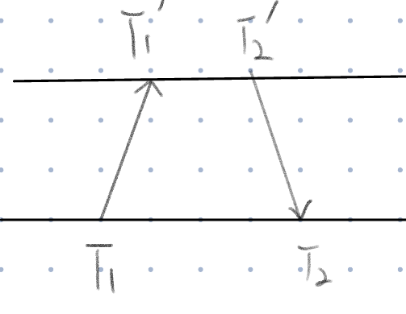

$$
T'_1-T_1=t_{trans}-\Delta t\\
T_2-T'_2=t_{trans}+\Delta t\\
2\Delta t=T_2-T'_2+T_1-T'_1\\
\Delta t=\frac{T_2-T'_2+T_1-T'_1}{2}
$$

如此便算出了(本机时间-远端时间)的值.对时钟的请求既可以由host发出,又可以由guest发出
这里注意为了保证两边发的消息大小一样,减少误差,$T_1$到$T'_1$这一步也要传两个0时间戳过去


### 6. (拓展功能)实现 virtio 的 guest 到 host 全链路追踪

#### 资料调研

我们找了很多关于 virtio 的资料，以及 qemu/kvm 中对 virtio 进行 tracing 的案例。发现 qemu 本身就支持 tracing 功能，但是其实并没有对 eBPF 的直接支持。发现基本找不到使用 eBPF 对 qemu 进行追踪的案例。所以我们只能自行想一个解决方案出来。

恰好，我们找到了一个使用 ftrace，trace-cmd 和 Kernel Shark 实现虚拟机 tracing 的案例。  [SP_OSTconf_VM_tracing_(1).pdf](https://ostconf.com/system/attachments/files/000/001/881/original/SP_OSTconf_VM_tracing_(1).pdf?1597069046)

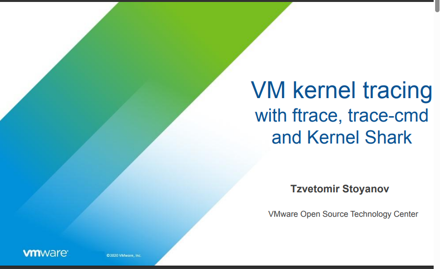

再仔细研究了其中 trace-cmd 实现 guest 和 host 协同 tracing 的思路，发现我们也可以做到。

我们实现这个 guest 和 host 协同追踪的思路就是：

- guest 中要挂载一个 agent，负责抓取 guest OS 中的对指定 virtio 设备的内核全路径的事件序列
- host 端也需要同时抓取 host OS 中的内核 IO 路径并且将请求缓存起来
- 在 guest 出现请求超时的时候，会把 guest 端采集到超时请求的 trace 信息发送到 host 端，并且由 host 端找出和该超时的 guest 请求匹配的 host 端的 virtio 请求，并且进行合并，在输出到日志。

然后我们进行了更具体地实现方案讨论：

- 我们要追踪 virtio，首先要清楚 virtio 从 guest 到 host 的处理流程是怎么样的。所以我们以 virtblk 为对象，研究这个 virtio 设备的请求是如何从 guest 到 qemu 再到 host kernel 的。
  - 在这个过程中，我们要实现对 qemu 对 virtblk 请求处理流程的追踪。
  - 要发掘 guest 的 virtblk 请求和 qemu 上的 virtblk 请求的关联信息。
  - 要发掘 qemu 的 virtblk 请求和 host OS 上的内核 IO 流程的关联信息。
- 对 qemu 的追踪的具体方案
  - 要基于 eBPF 实现对 qemu 的追踪，只能通过 uprobe/uretprobe 来实现。
  - 开发环境的配置。
  - qemu 内部的 guest agent 如何与 host 端进行高效的数据传输？

下面对我们的工作进行介绍：

要使用 uprobe/uretprobe 进行 qemu 的追踪，那么就需要搞清楚 uprobe 的使用条件

- uprobe 要求我们有 qemu 的完整的符号表。
- 如果想从 qemu 中获取其地址空间的数据， 则需要有 qemu 项目的头文件。

这两点就要求我们如果要对 qemu 进行追踪，就必须要求 qemu 是自己编译的而不是下载的二进制包，并且我们会涉及到把我们的项目和 qemu 的头文件一起编译的情况。

我们使用 libbpf-bootstrap 快速验证了用 uprobe 对 qemu 追踪的想法，确实需要自己编译 qemu，同时编写 CMakeLists.txt 把我们的项目和 qemu 的头文件一起编译出 bpf 程序。

在 `qemu_uprobe.bpf.c` 中，是我们关于 qemu 的 uprobe 追踪程序，其中使用了把 eBPF Map 来保证不同 eBPF 程序访问的 ringbuffer 是同一个。

其中因为需要访问 qemu 实现 virtio 时的一些数据结构，所以包含了几个 qemu 中的头文件，并且把用 C 宏把对 qemu 的 uprobe 挂载点进行了封装，使得不同人在复现这个项目时，只需要把 QEMU_EXE 项目改成自己编译出来的 qemu 路径即可。

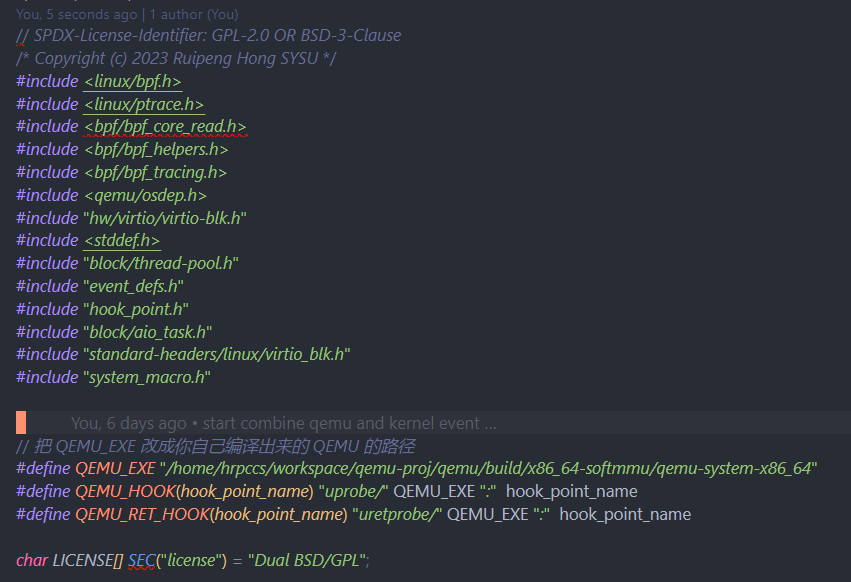

#### a. 对 qemu 追踪的过滤机制

目前在对 qemu 的 virtblk 请求进行追踪时，我们的策略是全都追踪，因为我们没有办法得知 guest OS 中的请求是否会超时，以及超时请求到底与哪一个 qemu 请求有关联。所以没有信息可以提前进行对 qemu virtblk 请求进行过滤。只能通过 qemu 本身的进程号进行过滤，不追踪 qemu 以外的请求。

这也导致了相比于单独的内核 IO 请求追踪，guest 和 host 协同对 virtblk 进行追踪的性能开销会很高。性能分析见[性能测试文档](./performance-test)

#### b. qemu 中的 virtblk 请求和 guest 中发送到 virtio 驱动的请求间建立联系

在初步跑通了对 qemu 的 uprobe 追踪后，我们通过阅读 qemu 4.2.1 的源码发现。

qemu 处理单一的 virtblk 请求的函数是 *virtio_blk_handle_request* ，其中参数类型为 VirtIOBlockReq* req，可以通过 req->sector_num 的方式可以获取到该 virtblk 请求读写的在 **guest 眼中的起始物理磁盘扇区号**。

而单一 virtblk 请求的结束标志则是 virtio_blk_req_complete 函数，通过这两个函数的触发时间，就可以确定该 virtblk 请求的**时间戳范围**。

但是通过 VirtIOBlockReq 类型没办法直接获取到该 virtblk 请求的**读写字节长度**。为了获取该属性，所以我们找了属于 virtblk 执行路径上的  qcow2_co_pwritev/preadv_part函数，通过其参数，就可以获取到就可以获取到实际 IO 的字节数量。

注意，我们用的 qcow2 作为 qemu 的虚拟磁盘，所以才会调用这些函数 qcow2* 之类的函数。

至此，我们就获取到了关联 guest 的 virtio request 和 qemu 中的 virtblk 请求的关键信息：读写区间，即偏移与长度。

我们通过测试发现，guest 中加入 virtio 设备的 request 的读写偏移是和 qemu 中获取到的信息是一模一样的。

那么，我们关联 qemu 请求和 guest 中请求的关键就是 request 的读写起始扇区号以及偏移。

#### c. qemu 中 virtblk 请求和 host 内核存储 IO 流程的联系

现在尝试分析 qemu virtblk 的请求是如何转换成对 host 的系统调用的。

通过查阅 qemu 的有关资料，阅读源码以及通过 uprobe 测试，我们发现 qemu 内部的 IO 机制比较复杂。

##### qemu 事件追踪的难点与解决方案

简单地说：qemu 内核通过协程来处理异步 IO，提高 IO 效率，需要对 qemu 的协程处理的异步 IO 进行追踪与关联。

qemu 使用的协程是不存在调度器的，所以在主动请求协程切换之前的所有事件都是同步的，发送在同一个上下文。在这个过程中，qemu 会把 virtblk 中对虚拟磁盘的读写区间转换成对 host os 上的磁盘文件的实际读写区间，在数据准备完成后，会调用 **raw_thread_pool_submit** 函数把对 host os 的 IO 请求分配给内存池中的一个线程，有它进行真正的 IO。

并且由于原来处理 qemu virtblk 的线程在执行 raw_thread_pool_submit 函数后，会继续处理其它的 virtblk 请求，这种情况单靠线程号没有办法避免一个线程处理多个 virtblk 的情况。而考虑到 qemu 的协程实现中不存在调度机制，所以在从 virtio_blk_handle_request 函数开始，直到 raw_thread_pool_submit，是一个完全同步的过程，为了便于讨论，称为 top-down 过程。

而当某个 virtblk 对应的异步 IO 完成之后，会触发 virtio_blk_req_complete 函数，该函数和 virtio_blk_handle_request 函数一样，都有涉及到的 virtblk 请求的唯一标识，并且两个函数发生在同一个上下文中。

**那么我们的解决方案就是：**

在用户态为每一个线程（上下文）维护一个列表，每当该线程处理一个新 virtblk 请求时，会给这个请求用 virtblk 的唯一标识标识上，然后每当有 top-down 过程中的同步事件触发，就会把该事件放到列表中最新的 virtblk 请求中。在某个 virtblk 对应的异步 IO 执行完成了，那么这个 virtblk 会触发 virtio_blk_handle_request ，那么这个事件会带有该 virtblk 的唯一标识，那么把 virtblk 的请求结束事件从列表中去除掉即可。

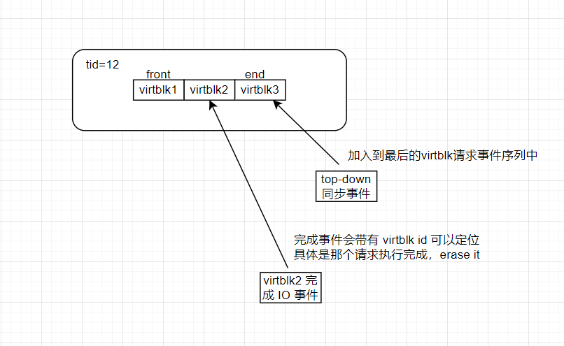

那么对于异步线程中对 host os 执行 IO 请求的追踪时，应该把事件关联到哪个 virtblk 请求中呢，答案在于 raw_thread_pool_submit 函数以及

在 qemu 源码 block/file-posix.c 中，可以看到在调用 raw_thread_pool_submit  提交 handle_aiocb_rw 异步任务时，会传递一个函数参数。那么后续触发 handle_aiocb_rw 函数的上下文中，如果其参数的地址是一样的，那么说明那个上下文的任务就是来自于调用 raw_thread_pool_submit  时的上下文的。

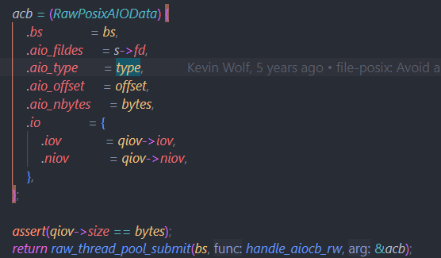

所以在 qemu 的 uprobe 程序中对 `handle_aiocb_rw` ` handle_aiocb_flush `   `raw_thread_pool_submit ` 三个函数进行追踪，在触发 `raw_thread_pool_submit ` 时，以函数参数的指针作为 key，当前线程的 tid 作为 value 插入到 eBPF Map 中。而在异步函数比如  `handle_aiocb_rw`  的入口处，根据自己的函数参数指针作为 key 在 eBPF Map 里找，是否存在一个 tid，如果有，那么说明本线程承担的 IO 请求是来自于该 tid 的，从而可以把异步 IO 关联上具体的 qemu virtblk 请求了。

#### d. 完成 guest 和 host 之间的协作追踪

在讨论了 b 和 c 后，我们已经可以实现 virtblk 请求从 guest 到 host 的全流程追踪了。

我们实现本项目基础功能时的简化版架构图如下，简单描述为两个线程之间的生产者和消费者模型。


现在把软件拓展到展到 guest 和 host 端能够协作追踪，我们把架构拓展成如下形式

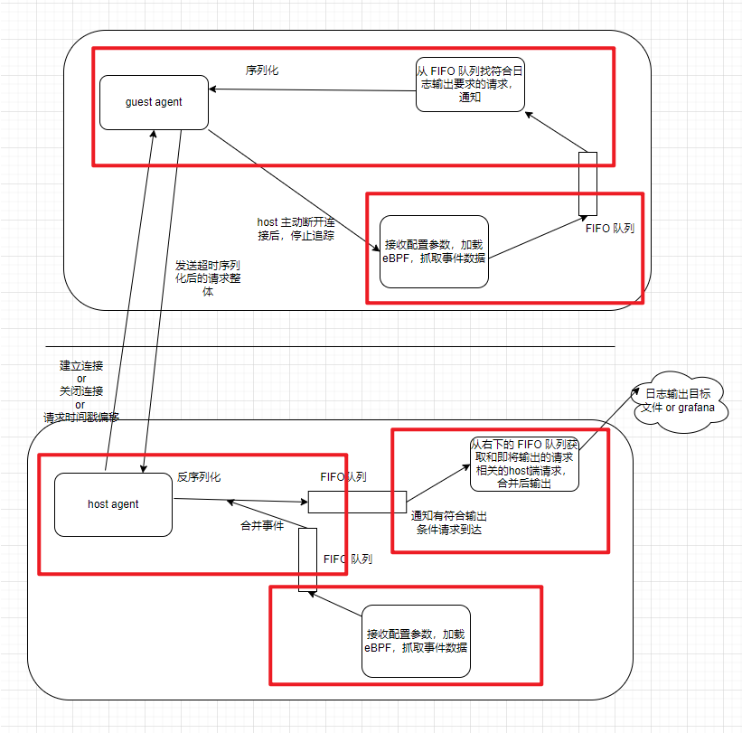

其中 guest agent 负责把超时的 guest 请求传输到 host 端。

而 host agent 则负责接收来自 guest 的数据，并且把数据代表的 guest 端请求和 host 端的 qemu 请求合并成一个完整的 guest 到 host 的请求，再送到专门处理日志输出的请求队列中去。

**我们的解决方案：**

我们写了一个利用 vsock 方便地在 guest 和 host 端传输数据的通信框架(详情看 [vsock通信框架](./doc/vsock_use.md)) ，该框架提供了以下功能：

- 利用 cereal 库对待传输请求进行序列化与反序列化。
- 通过 vsock 进行 guest 与 host 端的数据传输。
- 能够同步 guest 和 host 端的时间戳，从而让 guest 中 virtblk 请求和 host 中的 qemu 请求的各个事件能够对接地上。

我们在 host 端启动三个线程，除了抓取内核和 qemu 事件的线程，就是 HostAgent 和 Logger。其中 HostAgent 的 findAndMergeQemuRq 函数是用来从已有的qemu 请求中找到和到来的 guest IO 请求相合并，得到一个完整请求的。代码位于 `src/include/iotracer.h` 中

```cpp
void HostAgent() { // connect
    ServerEngine server;
    sem_post(&sem);
    // fprintf(stdout,"guest connected\n");
    while (!exiting) {
      Type type;
      void *data;
      server.recvMesg(type, data);
      if (type == TYPE_timestamps) {
        server.getDeltaHelper();
      } else if (type == TYPE_Request) {
        Request *req = (Request *)data;
        std::shared_ptr<Request> request(req);
        // 把刚刚反序列化的 request 先保存着
        // 直接从 native_request_queue 里面取出来
        auto newRq = findAndMergeQemuRq(request);
        {
          std::lock_guard<std::mutex> lock(request_to_log_queue.mutex);
          request_to_log_queue.results.push(newRq);
          sem_post(&request_to_log_queue.sem);
        }
      }
    }
  }

  void Logger() {
    while (!exiting) {
      std::shared_ptr<Request> request;
      sem_wait(&request_to_log_queue.sem);
      {
        std::lock_guard<std::mutex> lock(request_to_log_queue.mutex);
        if (request_to_log_queue.results.empty()) {
          continue;
        }
        request = request_to_log_queue.results.front();
        request_to_log_queue.results.pop();
      }
      done_request_handler->HandleDoneRequest(request, config);
    }
  }
```

在 guest 端启动两个线程，除了抓取事件的主线程，就是 guestAgent。

```cpp
void GuestAgent() { // connect
    ClientEngine client_engine;
    fprintf(stdout, "host connected\n");
    constexpr long long sync_timeout = 1e9 * 0.1; // 0.1s
    long long last_sync_time = 0;
    long long offset;
    while (!exiting) {
      std::shared_ptr<Request> request;
      sem_wait(&request_to_log_queue.sem);
      {
        long long curr = get_timestamp();
        if (curr - last_sync_time > sync_timeout) {
          offset = client_engine.getDelta();
          last_sync_time = curr;
        }
        {
          std::lock_guard<std::mutex> lock(request_to_log_queue.mutex);
          request = request_to_log_queue.results.front();
          request_to_log_queue.results.pop();
          request->guest_offset_time = offset;

          Request *req = request.get();
          int ret = client_engine.sendMesg(TYPE_Request, req); 
        }
      }
    }
  }

```

简单的功能展示如下（具体可以到查看 [功能测试文档](./doc/functional-test.md)

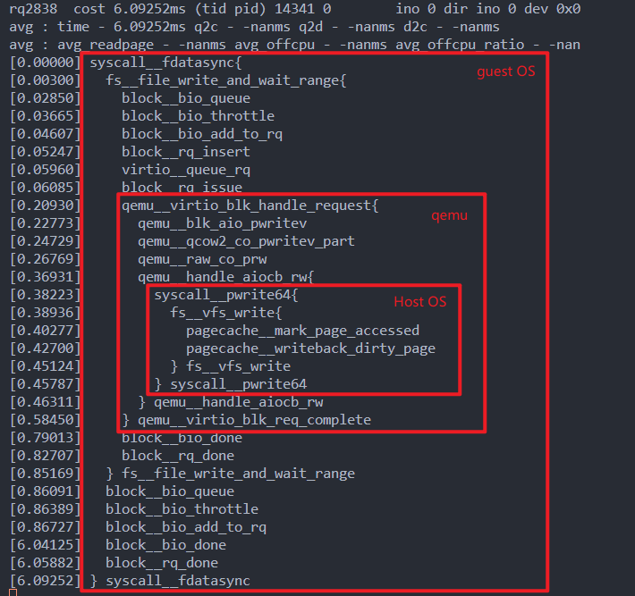

# 四、比赛收获

其实这是一个很有意思的项目，不仅涉及到了 Linux 内核的诸多子模块的 tracing 还涉及到虚拟化环境中对 qemu/kvm 场景下的 virtblk 在 guest 和 host OS 中的处理流程的理解和追踪。特别是关于对 qemu 中协程的理解以及对异步 IO 的关联追踪，在突破难题的时候感觉非常有趣。

此外，整个项目的 eBPF 部分花费最多时间的地方就是阅读和理解 Linux 的内核 IO 流程，并且选出合适的挂载点，其中涉及很多的子模块并且涉及很多 Linux 内核代码中一些特殊的代码，理解起来需要很多时间。除了 Linux 内核源码，还有对 qemu 的源码阅读。qemu 本身的资料其实非常少，只有国外的论坛会有一些 qemu 讲座资料。总而言之就是非常考验阅读和理解源代码的能力。

对 eBPF 的开销与功能认知更加清楚，借助 eBPF 对 Linux 内核有了更深认识。


# 五、项目分工


| 初赛 | 阶段               | 洪瑞鹏                                                       | 边润华                                                       | 涂越                                                     |
| ---- | ------------------ | ------------------------------------------------------------ | ------------------------------------------------------------ | -------------------------------------------------------- |
|      | 需求分析 - 4/29    | 1.     进行需求的描述            2.     编写技术原型验证可行性 | 1.     组织队伍,报名比赛,联系指导教师            2.     任务量的评估 | 1.     完成会议报告            2.     对需求进行初步总结 |
|      | 系统架构设计 - 5/5 | 1.     先设计一个简单、粗暴的可行架构，完成基础功能来提交初赛 | 1.     完成对 blktrace 工具的调研与提出性能更好的可行架构设计 |                                                          |
|      | 软件开发 - 6/10    | 1.     编写后端eBPF程序，从内核获取数据            2.     完成中端与后端数据传输的部分 | 调研Grafana,并编写了与Grafana交互的部分接口,预留作为后期使用 |                                                          |
|      | 软件测试 - 6/8     | 利用 sysbench 进行功能测试以及性能开销测试                   |                                                              | 使用 fio 进行性能开销测试                                |
|      | 其他               | 画系统架构图                                                 | 编写文档                                                     | 编写文档                                                 |
| 复赛 |                    | 调研 qemu/kvm，设计 guest 和 host 协同进行 virtio 全链路追踪 | 负责实现 qemu/kvm 场景下 host 与 guest 通过 vsock 通信框架   | 完成grafana的可视化                                      |
|      |                    | 负责复赛开发文档的编写                                       |                                                              |                                                          |
|      |                    | 负责 zero-tracer 的功能测试与性能测试                        |                                                              |                                                          |


# 六、参考资料

Linux 5.15 内核源码 [Linux source code (v5.15.97) - Bootlin](https://elixir.bootlin.com/linux/v5.15.97/source)

qemu v4.2.1 源码 

[A mapping layer for filesystems ](https://lwn.net/Articles/753650/)

[A block layer introduction part 1: the bio layer ](https://lwn.net/Articles/736534/)

[Block layer introduction part 2: the request layer ](https://lwn.net/Articles/738449/)

[akopytov/sysbench: Scriptable database and system performance benchmark](https://github.com/akopytov/sysbench)

https://mozillazg.com/2022/05/ebpf-libbpf-raw-tracepoint-common-questions-en.html

https://developer.ibm.com/articles/l-virtio/

[宋宝华：Linux文件读写（BIO）波澜壮阔的一生 - 腾讯云开发者社区-腾讯云](https://cloud.tencent.com/developer/article/1559291)

[EZTrace easy to use trace generator](https://eztrace.gitlab.io/eztrace/)